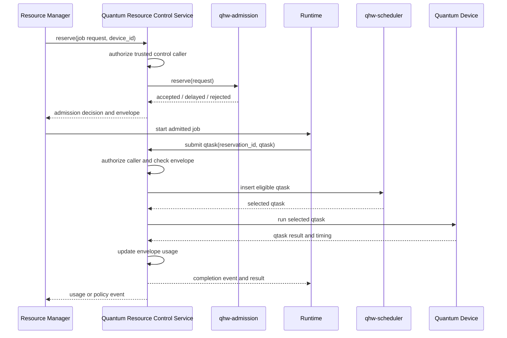

# qhw-admission Detailed Design

## Purpose

`qhw-admission` is a generic admission-control library for quantum resources.
It is the layer that decides whether a requested quantum workload should be
allowed to reserve capacity on a managed device. A single admission context can
manage one device or multiple devices. This allows the same library to run in a
small single-QPU service or in a Quantum Access Node that brokers access to
several quantum devices.

A caller submits a reservation request with workload metadata and a target
device identifier. The library evaluates that request against the matching
device profile, a resource estimator, the selected admission policy, and current
reservations for that device. The result is a structured admission decision.

The module provides quality-of-service control. It limits the active workload
accepted onto a quantum device, so downstream queues do not grow without bound.
It is intended for use by resource managers, runtime services, simulators, and
site-specific control planes.

The standard policy set includes three policies:

- `unlimited`: accept every internally valid request.
- `credit`: admit requests against a finite credit budget.
- `rate`: admit requests against a finite device throughput rate.

The implementation is written in C. The C API is the reference interface.
Python bindings should be generated with SWIG and wrapped in a small
Python package. CMake should build the C library, policy plugins,
estimators, C tests, SWIG extension, and Python tests.

## Quality Of Service Model

Admission control provides QoS by granting a bounded QPU usage envelope. The
library does not try to predict future quantum work perfectly. It estimates the
capacity needed by a request, admits that request only when the device can
absorb the demand, and records the capacity envelope that the runtime must
enforce as qtasks are submitted.

This differs from the classical walltime model. A classical job commonly holds
allocated CPUs or GPUs for the full walltime. A hybrid quantum job may use the
QPU intermittently while classical work runs between quantum calls. Reserving a
full QPU for the whole walltime would waste device capacity. Admission lets
multiple jobs share one QPU while limiting the active set so device queues do
not grow without bound.

Requests can describe demand at several levels of precision. A simple request
can provide a conservative envelope, such as maximum qtask shape and maximum
qtask count. A structured request can provide multiple qtask classes for finer
accounting. A measured request can use historical data from earlier runs to
provide better estimates. All three paths produce the same result: a bounded
reservation expressed in credits, rate units, estimated time, or policy-specific
capacity.

QoS depends on runtime enforcement. A job that submits more work than its
admitted envelope can consume capacity promised to other jobs. The runtime must
detect that condition through usage authorization and accounting. Policy can
then reject the excess task, delay it until capacity is available, throttle the
reservation, lower priority, charge additional capacity, or terminate the
reservation according to site rules.

Over-requesting also harms QoS because it holds capacity that other jobs could
use. The runtime should record unused reserved capacity when a reservation is
released or expires. Site policy can charge for reserved capacity, reduce future
reservation limits, lower confidence for future requests from the same workload,
or require renewal so idle reservations are reclaimed quickly.

The admission library should support feedback-driven estimator calibration. The
runtime should record estimated demand, admitted capacity, actual qtask usage,
unused capacity, overflow events, device timing, estimator version, and
workload metadata. Deterministic calibration should come before more complex
learning. Useful starting points include per-device safety margins, quantile
based correction factors, moving averages for repeated workloads, and
site-defined caps for low-confidence requests.

Reinforcement learning can be added as a policy or estimator plugin after
sufficient telemetry exists. A practical learning model would adjust margins or
choose estimator profiles, not bypass hard QoS limits. Its reward function
should penalize missed deadlines, queue growth, overuse, and idle reserved
capacity. The output still becomes an ordinary estimate and confidence value
consumed by admission policy.

## Runtime Interaction

The admission and scheduler libraries are passive. An active Quantum Resource
Control Service owns the device-facing state machine. The service can be a QPM
service, a Quantum Access Node service, or another runtime control process. It
exposes restricted admission/control APIs to trusted resource-manager or admin
components, and user-facing qtask APIs to applications and runtimes.

The service uses `qhw-admission` to decide whether a quantum job or hybrid job
can enter the active pool for a managed device. Accepted requests create an
admission envelope. The same service later receives qtask submissions, checks
the qtask against the stored envelope, enforces credits or rate limits, and
uses `qhw-scheduler` to order eligible qtasks. The scheduler library orders
tasks. The service owns envelope accounting, device events, authorization, and
the API boundary.

Admission/control APIs are control-plane APIs. Normal application code should
not be able to reserve capacity, release another job's reservation, renew a
reservation, or change policy. Those operations require a trusted caller such
as a resource-manager plugin, scheduler integration, site automation service,
or administrator. Runtime qtask APIs are data-plane APIs. They accept qtasks
only under an active reservation owned by the calling job or user.



## Scope

The library manages admission state for an admission service instance. A
context can register multiple device profiles keyed by `device_id`. Each device
has its own profile, estimator configuration, policy state, capacity counters,
and reservations. A single-device deployment is represented as one context with
one registered device.

The core library owns:

- device admission configuration
- device registry
- resource estimator configuration
- admission policy selection
- reservation accounting
- capacity accounting
- usage compliance accounting
- structured decision reporting
- optional task-level usage accounting

The caller owns:

- authentication
- resource-manager integration
- job launch
- scheduler integration
- provider submission
- result retrieval
- persistent storage

Admission decides whether a job or lease can enter the active set. Scheduling
decides which accepted quantum task occupies a QPU next.

## Design Goals

- Provide a C API that can be called from C, Python, resource-manager
  plugins, runtime services, and simulators.
- Keep admission policy separate from provider submission and task scheduling.
- Make workload payloads opaque. Admission operates on declared metadata and
  estimator outputs, not on provider-native circuit objects.
- Keep cost estimation pluggable. Different devices, providers, and sites can
  supply different estimators while using the same admission policies.
- Support deterministic evaluate and reserve operations. `evaluate()` is a
  dry run. `reserve()` atomically creates an admitted reservation.
- Return structured decisions that can be translated by external systems.
- Use policy plugins so site-specific admission policies can be added without
  changing the core library.
- Use SWIG for Python bindings.

## Repository Layout

The repository skeleton should stay small. Files should be added when the
implementation needs a separate compilation unit, not because the final design
might eventually grow there.

```text
qhw-admission/
  CMakeLists.txt
  pyproject.toml
  README.md
  LICENSE

  include/
    qhw_admission/
      qhw_admission.h
      qhw_admission_types.h

  src/
    qhw_admission_internal.h
    qhw_admission.c
    qhw_reservation.c
    qhw_error.c
    qhw_thread.c

    policies/
      unlimited.c
      credit.c
      rate.c

    estimators/
      baseline.c

    util/
      qhw_hash_table.c
      qhw_hash_table.h

  swg/
    qhw_admission.i
    qhw_admission_typemaps.i

  python/
    qhw_admission/
      __init__.py
      admission.py

  tests/
    c/
      test_core.c
      test_unlimited.c
      test_credit.c
      test_rate.c
      test_estimator.c
      test_lifecycle.c
      test_threading.c

    python/
      test_unlimited.py
      test_credit.py
      test_rate.py
      test_estimator.py
      test_lifecycle.py

  docs/
    detailed-design.md
    design-notes.md
    qhw-admission-standard.md
    policies.md
```

`qhw_admission.h` should include the public API and
`qhw_admission_types.h` should define public data structures. Split
headers only when the public surface becomes large enough to justify it.

Estimators use the plugin interface from the start. The standard distribution
provides a baseline estimator plugin in `src/estimators/baseline.c`. Hardware
vendors and sites can provide additional estimator plugins with the same
descriptor interface.

The core should load estimator plugins from three places. Standard plugins are
installed under the qhw-admission prefix. External plugins can be loaded by
explicit path. A caller can also add search paths for site-installed plugins
when plugin names are selected through configuration.

The repository skeleton includes only a hash table utility. Reservation lookup
is keyed by reservation ID and should not be linear. Expiration uses a scan in
the lean design because it is not on the hot reserve path. A heap or RB tree is
appropriate when expiration volume justifies it.

The README, detailed design, policy notes, and tests are the primary
documentation targets. Man pages belong with the finalized public API.

## Build System

CMake is the primary build system. It should build the core library, policy
plugins, estimator plugins, C tests, and SWIG-generated Python extension.
Python packaging should use `pyproject.toml` and `scikit-build-core`, matching
the direction used by `qhw-scheduler`.

Build options should be explicit:

```text
QHW_ADM_BUILD_SHARED=ON|OFF
QHW_ADM_BUILD_STATIC=ON|OFF
QHW_ADM_BUILD_PLUGINS=ON|OFF
QHW_ADM_BUILD_ESTIMATORS=ON|OFF
QHW_ADM_BUILD_PYTHON=ON|OFF
QHW_ADM_BUILD_TESTS=ON|OFF
QHW_ADM_INSTALL_PLUGINS=ON|OFF
QHW_ADM_INSTALL_ESTIMATORS=ON|OFF
```

When `QHW_ADM_BUILD_PYTHON=ON`, CMake should require SWIG, a Python
interpreter, and matching Python development headers. A build without those
dependencies should fail with a direct diagnostic. C-only builds can set
`QHW_ADM_BUILD_PYTHON=OFF`.

The standard build should produce:

- `libqhw_admission.so`
- `libqhw_admission.a`, when static builds are enabled
- `qhw_adm_unlimited.so`
- `qhw_adm_credit.so`
- `qhw_adm_rate.so`
- `qhw_adm_estimator_baseline.so`
- SWIG-generated Python extension module
- C and Python tests

## Install Layout

The install target should use the selected CMake prefix.

```text
<prefix>/
  include/
    qhw_admission/
      qhw_admission.h
      qhw_admission_types.h

  lib/
    libqhw_admission.so
    libqhw_admission.a

    qhw_admission/
      policies/
        qhw_adm_unlimited.so
        qhw_adm_credit.so
        qhw_adm_rate.so

      estimators/
        qhw_adm_estimator_baseline.so

    cmake/
      qhw_admission/
        qhw_admissionConfig.cmake
        qhw_admissionTargets.cmake

  lib/pkgconfig/
    qhw_admission.pc
```

## Core Data Model

The public data model is defined in `qhw_admission_types.h`. The field tables
in this section define the C fields in each public structure. Each public
descriptor begins with `struct_size` so implementations can validate the caller
view of the structure before reading fields.

| Structure | Visibility | Purpose | Use |
|---|---|---|---|
| `qhw_adm_attr_t` | Public | Context creation options. | Passed to `qhw_adm_create()` to select threading mode and context-wide options. |
| `qhw_adm_value_t` | Public | Tagged scalar value used by metadata and options. | Carries one typed metadata or option value without forcing all extension values into strings. |
| `qhw_adm_kv_t` | Public | Key-value metadata or option entry. | Forms metadata and option arrays attached to requests, devices, qtask classes, policies, and estimators. |
| `qhw_adm_baseline_t` | Public | Baseline circuit shape used for credit and rate accounting. | Defines the reference workload unit used to convert estimates into credits or rate units. |
| `qhw_adm_device_profile_t` | Public | Device admission profile registered with a context. | Supplies the device limits, baseline, and policy capacity used when evaluating requests for a target device. |
| `qhw_adm_capacity_snapshot_t` | Public | Scheduler or device capacity projection supplied through a callback. | Lets admission policies incorporate live queue, reservation, and availability state owned by the control service. |
| `qhw_adm_capacity_provider_t` | Public | Callback table used to obtain capacity snapshots. | Registered with the context so policies can request a fresh capacity projection during evaluation or reservation. |
| `qhw_adm_qtask_class_t` | Public | Resource-estimation shape for one class of qtasks. | Describes repeated quantum work in an admission request without requiring admission to parse task payloads. |
| `qhw_adm_request_t` | Public | Admission request submitted by the control service or resource manager. | Carries target device, owner, walltime, workload kind, qtask classes, and request metadata into `evaluate()` or `reserve()`. |
| `qhw_adm_estimate_t` | Public | Estimator output consumed by admission policies. | Reports estimated timing, baseline units, and confidence for the request or qtask class being evaluated. |
| `qhw_adm_decision_t` | Public | Structured admission or usage decision. | Returns accepted, delayed, rejected, retry, capacity, and diagnostic details to the caller. |
| `qhw_adm_reservation_t` | Public | Reservation state returned to callers. | Exposes the admitted capacity envelope, reservation lifecycle state, and accounting counters. |
| `qhw_adm_usage_t` | Public | Proposed or completed usage event. | Describes one qtask usage event that should be authorized, consumed, returned, or recorded. |
| `qhw_adm_usage_state_t` | Public | Aggregate reservation usage state. | Reports how much of an admitted reservation has been consumed and how much remains. |
| `qhw_adm_compliance_t` | Public | Overuse, underuse, and policy-action state. | Reports policy decisions tied to envelope violations or systematic underuse. |
| `qhw_adm_actual_usage_t` | Public | Measured usage record for feedback. | Feeds observed execution, compile, transfer, and control timing back into estimator calibration. |
| `qhw_adm_policy_desc_t` | Public plugin interface | Policy plugin descriptor. | Exported by policy plugins so the core can create, configure, and invoke the admission algorithm. |
| `qhw_adm_estimator_desc_t` | Public plugin interface | Estimator plugin descriptor. | Exported by estimator plugins so the core can create, configure, and invoke resource-estimation logic. |

Internal structures include the context object, device registry entries,
reservation table nodes, copied metadata storage, lock objects, plugin registry
entries, and policy or estimator private state. Those structures are defined
only in private implementation headers.

### Metadata Values

Several public structures need extensible metadata. The public representation
uses a typed key-value array so requests, device profiles, qtask classes, and
policy options can carry extension values without changing the base structure.

| Structure | Visibility | Purpose | Use |
|---|---|---|---|
| `qhw_adm_kv_t` | Public | Generic key-value option and metadata entry. | Used anywhere the public API accepts extensible metadata or configuration. |
| `qhw_adm_value_t` | Public | Tagged scalar value used by key-value entries. | Carries one typed scalar in a `qhw_adm_kv_t` entry. |

Supported scalar types are unsigned integers, signed integers, doubles,
booleans, and strings. Binary values are an extension point for compact opaque
metadata.

The public C representation is:

```c
typedef enum qhw_adm_value_type {
	QHW_ADM_VALUE_U64 = 1,
	QHW_ADM_VALUE_I64 = 2,
	QHW_ADM_VALUE_F64 = 3,
	QHW_ADM_VALUE_BOOL = 4,
	QHW_ADM_VALUE_STRING = 5
} qhw_adm_value_type_t;

typedef struct qhw_adm_value {
	qhw_adm_value_type_t type;
	union {
		uint64_t u64;
		int64_t i64;
		double f64;
		bool boolean;
		const char *string;
	} data;
} qhw_adm_value_t;

typedef struct qhw_adm_kv {
	uint64_t key;
	qhw_adm_value_t value;
} qhw_adm_kv_t;
```

String values are borrowed for the duration of the public API call. The library
copies strings when a value is stored in context-owned state.

Metadata is part of the admission contract. The core request fields cover the
common near-term circuit shape, while metadata carries estimator inputs,
policy hints, and scheduler-derived capacity state. The admission core treats
payloads as opaque and relies on declared metadata instead of parsing provider
circuit formats.

Standard metadata keys should cover the information needed for resource
estimation and admission policy:

- Workload kind describes how the request should be interpreted. Standard
  values are `quantum_job` and `hybrid_job`. Quantum jobs submit qtasks without
  coupled classical resources waiting on QPU progress. Hybrid jobs submit qtasks
  while holding coupled classical resources, so delayed QPU progress can leave
  those resources idle.
- NISQ shape describes near-term circuit demand. Standard fields should cover
  qubit count, circuit depth, one-qubit gate count, two-qubit gate count,
  shots, and measurements. These fields let estimators compute execution time
  without parsing the circuit payload.
- FTQC shape describes fault-tolerant quantum workloads. Standard fields
  should cover logical qubits, logical depth or logical cycles, T-count,
  T-depth, target logical error rate, code family, code distance, magic-state
  demand, decoder overhead, and classical control overhead.
- Timing hints provide measured or caller-supplied costs when they are known.
  Standard fields should cover compile time, lowering time, transfer time,
  control-system setup time, measurement time, batching behavior, and
  provider-side fixed overheads.
- Policy hints describe how the request should be treated by admission policy.
  Standard fields should cover priority, deadline, requested QoS class, latest
  acceptable start time, latest acceptable finish time, and reservation scope.
- Feedback metadata records information used to calibrate future estimates.
  Standard fields should cover estimator version, observed device time, consumed
  credits, consumed rate, unused capacity, and over-limit events.

The public metadata keys can use names such as:

| Key | Purpose |
|---|---|
| `QHW_ADM_META_WORKLOAD_KIND` | Quantum-job or hybrid-job interpretation. |
| `QHW_ADM_META_SESSION_ID` | External session or workflow identifier. |
| `QHW_ADM_META_DEADLINE_NS` | Deadline associated with the reservation request. |
| `QHW_ADM_META_LATEST_START_NS` | Latest acceptable projected start time. |
| `QHW_ADM_META_LATEST_FINISH_NS` | Latest acceptable projected finish time. |
| `QHW_ADM_META_QOS_CLASS` | Site-defined QoS class. |
| `QHW_ADM_META_LAYER_COUNT` | Additional NISQ circuit-layer count. |
| `QHW_ADM_META_BATCH_COUNT` | Number of batches expected by the workload. |
| `QHW_ADM_META_PROVIDER_BATCHING` | Provider-side batching mode or hint. |
| `QHW_ADM_META_COMPILE_NS` | Estimated or measured compilation time. |
| `QHW_ADM_META_LOWERING_NS` | Estimated or measured lowering time. |
| `QHW_ADM_META_TRANSFER_NS` | Estimated or measured transfer time. |
| `QHW_ADM_META_CONTROL_OVERHEAD_NS` | Fixed control-system overhead. |
| `QHW_ADM_META_PROVIDER_OVERHEAD_NS` | Provider-side fixed overhead. |
| `QHW_ADM_META_LOGICAL_QUBITS` | Logical qubits required by an FTQC workload. |
| `QHW_ADM_META_LOGICAL_CYCLES` | Logical cycles or logical depth. |
| `QHW_ADM_META_T_COUNT` | T-count for FTQC estimation. |
| `QHW_ADM_META_T_DEPTH` | T-depth for FTQC estimation. |
| `QHW_ADM_META_TARGET_LOGICAL_ERROR_PPM` | Target logical error rate. |
| `QHW_ADM_META_CODE_FAMILY` | Error-correction code family. |
| `QHW_ADM_META_CODE_DISTANCE` | Error-correction code distance. |
| `QHW_ADM_META_MAGIC_STATE_COUNT` | Magic-state demand. |
| `QHW_ADM_META_DECODER_OVERHEAD_NS` | Decoder-side classical overhead. |
| `QHW_ADM_META_CLASSICAL_CONTROL_OVERHEAD_NS` | Runtime classical control overhead. |
| `QHW_ADM_META_ESTIMATOR_VERSION` | Estimator identity used for feedback records. |
| `QHW_ADM_META_OBSERVED_DEVICE_NS` | Measured device time from a completed reservation or qtask. |
| `QHW_ADM_META_CONSUMED_CREDITS` | Credits consumed by actual usage. |
| `QHW_ADM_META_CONSUMED_RATE` | Rate consumed by actual usage. |
| `QHW_ADM_META_UNUSED_CAPACITY` | Capacity reserved but returned unused. |
| `QHW_ADM_META_OVER_LIMIT_EVENTS` | Count of usage events that exceeded the admitted envelope. |

`QHW_ADM_META_WORKLOAD_KIND` maps to standard values:

| Value | Meaning |
|---|---|
| `QHW_ADM_WORKLOAD_QUANTUM_JOB` | The request describes a quantum-only job that may submit one or more qtasks. |
| `QHW_ADM_WORKLOAD_HYBRID_JOB` | The request describes the maximum quantum demand expected during a hybrid job. |

Quantum-job requests describe quantum-only work that does not hold coupled
classical resources while waiting for QPU progress. Hybrid-job requests describe
an upper bound for all quantum work expected during the job walltime. Admission
evaluates the full envelope before the application starts, then usage
accounting enforces the admitted capacity as qtasks are submitted.

Batches and workflows are represented above the admission layer. A batch runner
can submit a quantum-job request or request a hybrid-job envelope for the whole
batch. A workflow manager can decompose a graph into quantum-job and hybrid-job
requests. The device-facing admission layer only evaluates the quantum work
presented through those two workload kinds.

FTQC estimators consume different metadata than NISQ estimators. A
fault-tolerant estimator may translate logical qubits, logical cycles, T-count,
T-depth, code distance, magic-state demand, decoder overhead, and target error
rate into physical time and baseline units. This keeps FTQC support in
estimator plugins while preserving the same admission policy interface.

Admission policies also need projected device state. The admission core obtains
that state through a capacity-provider callback that returns a standard
snapshot:

```c
typedef qhw_adm_rc_t (*qhw_adm_get_capacity_snapshot_fn)(
	uint64_t device_id,
	uint64_t scope_id,
	qhw_adm_capacity_snapshot_t *out_snapshot,
	void *user_data);

typedef struct qhw_adm_capacity_provider {
	size_t struct_size;
	qhw_adm_get_capacity_snapshot_fn get_snapshot;
	void *user_data;
} qhw_adm_capacity_provider_t;
```

| Structure | Purpose | Use |
|---|---|---|
| `qhw_adm_capacity_provider_t` | Holds the callback used to obtain projected capacity state. | The caller registers it with `qhw_adm_set_capacity_provider()` so the admission core can ask the control service for live device or scheduler state. |
| `qhw_adm_capacity_snapshot_t` | Holds one capacity projection for a device and policy scope. | Returned by the provider callback and consumed by policies when evaluating or reserving capacity. |

`qhw_adm_capacity_snapshot_t` contains:

| Field | C type | Meaning |
|---|---|---|
| `struct_size` | `size_t` | Size of the structure supplied by the caller. |
| `device_id` | `uint64_t` | Device described by the snapshot. |
| `device_state` | `qhw_adm_device_state_t` | Device availability used by admission decisions. |
| `now_ns` | `uint64_t` | Timestamp used for projected capacity and timing values. |
| `next_available_ns` | `uint64_t` | Earliest projected time that newly admitted work can start. |
| `queued_baseline_units` | `uint64_t` | Queued work expressed in baseline units. |
| `queued_estimated_ns` | `uint64_t` | Queued work expressed as estimated device time. |
| `active_reservation_count` | `uint64_t` | Number of reservations that hold capacity. |
| `available_credits` | `uint64_t` | Credit capacity available to credit-based policies. |
| `available_rate` | `uint64_t` | Rate capacity available to rate-based policies. |
| `scheduler_policy_id` | `uint64_t` | Identifier for the active scheduler policy. |
| `confidence_ppm` | `uint32_t` | Confidence in the projection. |
| `metadata` | `const qhw_adm_kv_t *` | Scheduler or device-specific extension values. |
| `metadata_count` | `size_t` | Number of metadata entries. |

The callback lets `qhw-admission` use live scheduler and device state without
depending on a specific scheduler implementation. A runtime can populate the
snapshot from `qhw-scheduler`, a simulator, a vendor service, telemetry, or a
site-specific control plane.

Admission timing guidance is reservation-level. An accepted decision should
include a projected start time, finish time, and confidence value for the
admitted envelope. The scheduler owns task-level timing guidance. When a task
is submitted under a reservation, the scheduler can return a more specific
estimated start time and estimated device occupancy for that task. Workload
managers can use those projections to decide when classical resources should be
allocated or held.

### Baseline Circuit Shape

The baseline circuit shape is the reference unit for credit and rate
accounting. It is represented by `qhw_adm_baseline_t`. A device rate is
expressed in baseline units per time span.

| Field | C type | Meaning |
|---|---|---|
| `struct_size` | `size_t` | Size of the structure supplied by the caller. |
| `qubit_count` | `uint32_t` | Number of qubits in the baseline circuit. |
| `depth` | `uint64_t` | Circuit depth used as a scaling reference. |
| `one_q_gate_count` | `uint64_t` | Number of one-qubit gates. |
| `two_q_gate_count` | `uint64_t` | Number of two-qubit gates. |
| `shots` | `uint64_t` | Number of shots. |
| `measurement_count` | `uint64_t` | Number of measurements or measured qubits. |

The baseline shape is configurable because each site needs a practical unit of
accounting. A device may choose a small benchmark circuit, a representative
production circuit, or a conservative default.

### Device Profile

The device profile describes one admission target. It is represented by
`qhw_adm_device_profile_t` and registered with the admission context before
requests can target the device.

| Field | C type | Meaning |
|---|---|---|
| `struct_size` | `size_t` | Size of the structure supplied by the caller. |
| `device_id` | `uint64_t` | Local numeric device identifier. |
| `time_span_ns` | `uint64_t` | Accounting window for rate calculations. |
| `baseline` | `qhw_adm_baseline_t` | Baseline circuit shape. |
| `max_qubits` | `uint32_t` | Maximum supported qubit count. |
| `max_shots` | `uint64_t` | Maximum shots per task, if known. |
| `total_credits` | `uint64_t` | Total credit capacity for credit policy. |
| `device_rate` | `uint64_t` | Baseline units per time span for rate policy. |
| `concurrent_jobs` | `uint32_t` | Target concurrency for rate-slice defaults. |
| `metadata` | `const qhw_adm_kv_t *` | Device-specific values used by estimators or policies. |
| `metadata_count` | `size_t` | Number of metadata entries. |

If `device_rate` is zero, the rate policy derives it from the selected
estimator:

```text
device_rate = ceil(time_span_ns / estimated_baseline_ns)
```

### Admission Request

An admission request describes the expected quantum demand of a job, lease, or
session. It is represented by `qhw_adm_request_t`. It contains one or more
qtask class descriptors that describe the quantum work covered by the request.

| Field | C type | Meaning |
|---|---|---|
| `struct_size` | `size_t` | Size of the structure supplied by the caller. |
| `request_id` | `uint64_t` | Caller-generated request identifier. |
| `device_id` | `uint64_t` | Target device registered in the admission context. |
| `user_id` | `uint64_t` | User, account, or tenant identifier. |
| `job_id` | `uint64_t` | External job identifier, if available. |
| `reservation_id` | `uint64_t` | Optional caller-provided reservation identifier. |
| `workload_kind` | `qhw_adm_workload_kind_t` | Quantum-job or hybrid-job request type. |
| `walltime_ns` | `uint64_t` | Requested job walltime. |
| `classical_runtime_ns` | `uint64_t` | Expected non-QPU runtime. |
| `overhead_ns` | `uint64_t` | Runtime overhead subtracted from quantum budget. |
| `priority` | `int64_t` | Optional admission priority. |
| `task_class_count` | `size_t` | Number of qtask classes. |
| `task_classes` | `const qhw_adm_qtask_class_t *` | Array of qtask class descriptors. |
| `metadata` | `const qhw_adm_kv_t *` | Request-level metadata. |
| `metadata_count` | `size_t` | Number of metadata entries. |

The quantum budget is:

```text
quantum_budget_ns = walltime_ns - classical_runtime_ns - overhead_ns
```

### Qtask Class

Admission control needs enough job metadata to calculate the credits or rate
required by a request. A qtask class is the structure that carries that
metadata for a qtask shape. It gives the caller a granular way to describe the
quantum work in the parent admission request.

Workload kind describes the admission request type. Qtask classes describe the
quantum work inside that request.

A quantum-job request can contain one or more qtask classes. A hybrid-job
request can also contain one or more qtask classes. Each class represents one
qtask shape expected during the job.

A request can use one class as a conservative envelope. In that mode, the class
describes the maximum qtask shape the job expects to submit, and `count` is the
maximum number of qtasks covered by the reservation. A caller with more workload
knowledge can provide multiple classes for finer accounting. Multiple classes
reduce over-reservation when most qtasks are smaller than the largest expected
qtask.

| Field | C type | Meaning |
|---|---|---|
| `struct_size` | `size_t` | Size of the structure supplied by the caller. |
| `class_id` | `uint64_t` | Caller-defined identifier for diagnostics and decision records. |
| `count` | `uint64_t` | Number of qtasks with this shape. |
| `qubit_count` | `uint32_t` | Expected or maximum qubit count. |
| `depth` | `uint64_t` | Expected or maximum circuit depth. |
| `one_q_gate_count` | `uint64_t` | Expected one-qubit gate count. |
| `two_q_gate_count` | `uint64_t` | Expected two-qubit gate count. |
| `shots` | `uint64_t` | Expected shot count. |
| `measurement_count` | `uint64_t` | Expected measurement count. |
| `metadata` | `const qhw_adm_kv_t *` | Estimator-specific extension inputs. |
| `metadata_count` | `size_t` | Number of metadata entries. |

Common qtask class entries include:

| Class entry | Use |
|---|---|
| Exact qtask | One qtask with known metadata and `count = 1`. |
| Repeated NISQ shape | Many qtasks with the same near-term circuit shape. |
| Conservative NISQ envelope | Many qtasks charged at the maximum expected near-term shape. |
| FTQC logical shape | One or more logical workloads described through FTQC metadata. |

Multiple qtask classes allow a request to represent a mixed workload without
charging every qtask at the maximum observed size. If every qtask has a
different shape, the caller can provide several classes or use a conservative
envelope class.

### Estimate

An estimate is the resource model produced from an admission request and a
device profile. The estimator reads the request's qtask classes, request
metadata, device profile, baseline circuit shape, and estimator configuration.
It returns the projected time and accounting values used by admission policy.

| Field | C type | Meaning |
|---|---|---|
| `struct_size` | `size_t` | Size of the structure supplied by the caller. |
| `execution_ns` | `uint64_t` | Estimated QPU execution time. |
| `measurement_ns` | `uint64_t` | Estimated measurement contribution. |
| `compile_ns` | `uint64_t` | Estimated compilation or lowering time. |
| `transfer_ns` | `uint64_t` | Estimated transfer time to the control system. |
| `control_overhead_ns` | `uint64_t` | Estimated control-system setup overhead. |
| `total_ns` | `uint64_t` | Total estimated time used for admission. |
| `baseline_units` | `uint64_t` | Work expressed in baseline-circuit units. |
| `confidence_ppm` | `uint32_t` | Optional confidence in parts per million. |

When an estimator returns `baseline_units = 0`, the core derives baseline
units from total time:

```text
baseline_units = ceil(total_ns / estimated_baseline_ns)
```

### Decision

Admission returns a structured decision.

| Value | Meaning |
|---|---|
| `QHW_ADM_DECISION_ACCEPTED` | The request was admitted. |
| `QHW_ADM_DECISION_DELAYED` | The request fits the device but capacity is unavailable. |
| `QHW_ADM_DECISION_REJECTED` | The request cannot be supported. |

The decision object is represented by `qhw_adm_decision_t`.

| Field | C type | Meaning |
|---|---|---|
| `struct_size` | `size_t` | Size of the structure supplied by the caller. |
| `decision` | `qhw_adm_decision_kind_t` | Accepted, delayed, or rejected result. |
| `request_id` | `uint64_t` | Request associated with the decision. |
| `device_id` | `uint64_t` | Device evaluated by the decision. |
| `reservation_id` | `uint64_t` | Reservation created for accepted requests. |
| `reason_code` | `uint64_t` | Machine-readable reason. |
| `credits_required` | `uint64_t` | Credit demand for the request. |
| `rate_required` | `uint64_t` | Rate demand for the request. |
| `capacity_available` | `uint64_t` | Available capacity at decision time. |
| `estimated_total_ns` | `uint64_t` | Estimated total quantum demand. |
| `estimated_start_ns` | `uint64_t` | Projected start time for the admitted envelope. |
| `estimated_finish_ns` | `uint64_t` | Projected finish time for the admitted envelope. |
| `latest_finish_ns` | `uint64_t` | Latest finish time allowed by the request or policy. |
| `quantum_budget_ns` | `uint64_t` | Available quantum budget. |
| `capacity_granted` | `uint64_t` | Capacity granted by the selected policy. |
| `compliance_action` | `qhw_adm_compliance_action_t` | Action applied when requested or observed use violates policy. |
| `retry_after_ns` | `uint64_t` | Optional retry hint. |
| `confidence_ppm` | `uint32_t` | Confidence in timing and capacity projections. |
| `message` | `const char *` | Human-readable diagnostic text owned by the context. |
| `metadata` | `const qhw_adm_kv_t *` | Policy-specific decision metadata. |
| `metadata_count` | `size_t` | Number of metadata entries. |

### Reservation

A reservation records capacity held for an accepted request. It is represented
by `qhw_adm_reservation_t`.

| Field | C type | Meaning |
|---|---|---|
| `struct_size` | `size_t` | Size of the structure supplied by the caller. |
| `reservation_id` | `uint64_t` | Reservation identifier. |
| `request_id` | `uint64_t` | Request that created the reservation. |
| `device_id` | `uint64_t` | Device that accepted the reservation. |
| `user_id` | `uint64_t` | User, account, or tenant identifier. |
| `job_id` | `uint64_t` | External job identifier, if available. |
| `workload_kind` | `qhw_adm_workload_kind_t` | Quantum-job or hybrid-job request type. |
| `state` | `qhw_adm_reservation_state_t` | Pending, active, released, expired, or cancelled. |
| `credits_reserved` | `uint64_t` | Credits held by credit policy. |
| `credits_consumed` | `uint64_t` | Credits consumed by task-level accounting. |
| `rate_reserved` | `uint64_t` | Rate units held by rate policy. |
| `rate_consumed` | `uint64_t` | Rate units consumed by task-level accounting. |
| `estimated_total_ns` | `uint64_t` | Estimated quantum demand. |
| `actual_total_ns` | `uint64_t` | Actual accounted quantum usage. |
| `unused_capacity` | `uint64_t` | Reserved capacity returned unused at release or expiration. |
| `overuse_count` | `uint64_t` | Number of tasks or usage events that exceeded the envelope. |
| `underuse_score` | `uint64_t` | Policy-defined measure of systematic over-requesting. |
| `created_at_ns` | `uint64_t` | Creation timestamp. |
| `expires_at_ns` | `uint64_t` | Lease expiration time. |
| `metadata` | `const qhw_adm_kv_t *` | Reservation metadata copied from the request or policy. |
| `metadata_count` | `size_t` | Number of metadata entries. |

### Usage Accounting Structures

Usage accounting is the public structure set used by a control service to
enforce an admitted envelope while qtasks execute. The service calls these APIs
when it needs the admission library to authorize, consume, return, or record
reservation capacity.

| Structure | Visibility | Purpose | Use |
|---|---|---|---|
| `qhw_adm_usage_t` | Public | Describes one proposed or completed qtask usage event. | Passed to authorization, consume, and return APIs when the control service enforces a reservation envelope. |
| `qhw_adm_usage_state_t` | Public | Reports aggregate usage for one reservation. | Returned by `qhw_adm_get_usage()` for runtime diagnostics, accounting, and operator visibility. |
| `qhw_adm_compliance_t` | Public | Reports overuse, underuse, and policy action state. | Returned by `qhw_adm_get_compliance()` so the control service can react to policy violations. |
| `qhw_adm_actual_usage_t` | Public | Carries measured usage for estimator feedback. | Passed to `qhw_adm_record_actual()` after qtask execution or reservation completion. |

`qhw_adm_usage_t` contains:

| Field | C type | Meaning |
|---|---|---|
| `struct_size` | `size_t` | Size of the structure supplied by the caller. |
| `reservation_id` | `uint64_t` | Reservation charged by the event. |
| `task_id` | `uint64_t` | Runtime qtask identifier, if available. |
| `class_id` | `uint64_t` | Qtask class that best describes the event. |
| `estimated_ns` | `uint64_t` | Estimated device time for the event. |
| `actual_ns` | `uint64_t` | Measured device time when known. |
| `baseline_units` | `uint64_t` | Work expressed in baseline units. |
| `credits` | `uint64_t` | Credits charged or returned. |
| `rate_units` | `uint64_t` | Rate units charged or returned. |
| `metadata` | `const qhw_adm_kv_t *` | Event-specific metadata. |
| `metadata_count` | `size_t` | Number of metadata entries. |

`qhw_adm_usage_state_t` contains:

| Field | C type | Meaning |
|---|---|---|
| `struct_size` | `size_t` | Size of the structure supplied by the caller. |
| `reservation_id` | `uint64_t` | Reservation being reported. |
| `credits_reserved` | `uint64_t` | Credits admitted for the reservation. |
| `credits_consumed` | `uint64_t` | Credits consumed so far. |
| `rate_reserved` | `uint64_t` | Rate units admitted for the reservation. |
| `rate_consumed` | `uint64_t` | Rate units consumed so far. |
| `estimated_total_ns` | `uint64_t` | Estimated total device time. |
| `actual_total_ns` | `uint64_t` | Actual recorded device time. |
| `remaining_credits` | `uint64_t` | Credits still available under the reservation. |
| `remaining_rate` | `uint64_t` | Rate units still available under the reservation. |

`qhw_adm_compliance_t` contains:

| Field | C type | Meaning |
|---|---|---|
| `struct_size` | `size_t` | Size of the structure supplied by the caller. |
| `reservation_id` | `uint64_t` | Reservation being reported. |
| `overuse_count` | `uint64_t` | Number of over-limit events. |
| `underuse_score` | `uint64_t` | Policy-defined underuse score. |
| `unused_capacity` | `uint64_t` | Reserved capacity returned unused. |
| `action` | `qhw_adm_compliance_action_t` | Policy action selected for the current state. |
| `message` | `const char *` | Human-readable diagnostic text owned by the context. |

`qhw_adm_actual_usage_t` contains:

| Field | C type | Meaning |
|---|---|---|
| `struct_size` | `size_t` | Size of the structure supplied by the caller. |
| `reservation_id` | `uint64_t` | Reservation associated with the measurement. |
| `task_id` | `uint64_t` | Runtime qtask identifier, if available. |
| `observed_device_ns` | `uint64_t` | Measured device occupancy. |
| `observed_compile_ns` | `uint64_t` | Measured compilation or lowering time. |
| `observed_transfer_ns` | `uint64_t` | Measured transfer time. |
| `observed_control_overhead_ns` | `uint64_t` | Measured control overhead. |
| `metadata` | `const qhw_adm_kv_t *` | Feedback metadata. |
| `metadata_count` | `size_t` | Number of metadata entries. |

## Resource Estimator Plugin Interface

The estimator converts task metadata into timing and baseline-unit estimates.
It is a plugin surface because cost differs across hardware, control systems,
compilation paths, calibration state, and site policy.

The public plugin descriptor is `qhw_adm_estimator_desc_t`:

```c
typedef qhw_adm_rc_t (*qhw_adm_estimator_init_fn)(
	const qhw_adm_device_profile_t *device,
	const qhw_adm_kv_t *options,
	size_t option_count,
	void **out_state);

typedef void (*qhw_adm_estimator_destroy_fn)(void *state);

typedef qhw_adm_rc_t (*qhw_adm_estimator_configure_fn)(
	void *state,
	const qhw_adm_kv_t *options,
	size_t option_count);

typedef qhw_adm_rc_t (*qhw_adm_estimator_estimate_task_fn)(
	void *state,
	const qhw_adm_device_profile_t *device,
	const qhw_adm_qtask_class_t *task_class,
	qhw_adm_estimate_t *out_estimate);

typedef qhw_adm_rc_t (*qhw_adm_estimator_estimate_request_fn)(
	void *state,
	const qhw_adm_device_profile_t *device,
	const qhw_adm_request_t *request,
	qhw_adm_estimate_t *out_estimate);

typedef qhw_adm_rc_t (*qhw_adm_estimator_estimate_baseline_fn)(
	void *state,
	const qhw_adm_device_profile_t *device,
	const qhw_adm_baseline_t *baseline,
	qhw_adm_estimate_t *out_estimate);

typedef qhw_adm_rc_t (*qhw_adm_estimator_validate_request_fn)(
	void *state,
	const qhw_adm_device_profile_t *device,
	const qhw_adm_request_t *request);

typedef struct qhw_adm_estimator_desc {
	size_t struct_size;
	uint32_t abi_version;
	const char *name;
	uint64_t capabilities;
	qhw_adm_estimator_init_fn init;
	qhw_adm_estimator_destroy_fn destroy;
	qhw_adm_estimator_configure_fn configure;
	qhw_adm_estimator_estimate_task_fn estimate_task;
	qhw_adm_estimator_estimate_request_fn estimate_request;
	qhw_adm_estimator_estimate_baseline_fn estimate_baseline;
	qhw_adm_estimator_validate_request_fn validate_request;
} qhw_adm_estimator_desc_t;
```

| Structure | Purpose | Use |
|---|---|---|
| `qhw_adm_estimator_desc_t` | Describes one estimator plugin and its callback surface. | The core reads this descriptor after loading an estimator shared object, then calls its callbacks for request validation and resource estimation. |

| Field | C type | Meaning |
|---|---|---|
| `struct_size` | `size_t` | Descriptor size for compatibility checks. |
| `abi_version` | `uint32_t` | Plugin ABI version supported by the estimator. |
| `name` | `const char *` | Estimator name used by `qhw_adm_set_estimator()`. |
| `capabilities` | `uint64_t` | Supported estimation modes and metadata requirements. |
| `init` | `qhw_adm_estimator_init_fn` | Create estimator-local state. |
| `destroy` | `qhw_adm_estimator_destroy_fn` | Destroy estimator-local state. |
| `configure` | `qhw_adm_estimator_configure_fn` | Apply estimator options. |
| `estimate_task` | `qhw_adm_estimator_estimate_task_fn` | Estimate one qtask class. |
| `estimate_request` | `qhw_adm_estimator_estimate_request_fn` | Estimate a whole request. |
| `estimate_baseline` | `qhw_adm_estimator_estimate_baseline_fn` | Estimate the configured baseline. |
| `validate_request` | `qhw_adm_estimator_validate_request_fn` | Validate request metadata. |

If `estimate_request()` is provided, the core uses it. Whole-request estimation
can account for batching, repeated compilation, shared transfer costs, and
provider-side execution behavior. If it is absent, the core sums
`count * estimate_task()` across the task classes.

The baseline estimator should use configurable timing fields:

```text
gate_ns =
  one_q_gate_count * one_q_gate_ns
  + two_q_gate_count * two_q_gate_ns

execution_ns = (gate_ns + measurement_ns) * shots

transfer_ns =
  one_q_gate_count * one_q_gate_transfer_ns
  + two_q_gate_count * two_q_gate_transfer_ns
  + measurement_transfer_ns

total_ns =
  execution_ns + transfer_ns + compile_ns + control_overhead_ns
```

Provider estimators can replace this with measured timing, backend target
properties, calibration-derived timing, control-system models, or external
resource-estimation tools.

External estimator plugins are shared objects. The caller can load one directly
with `qhw_adm_load_estimator(ctx, path)`, or add a directory to the estimator
search path and select the estimator by name. Loading by explicit path is useful
for tests and development. Search paths are better for site deployments where
estimators are installed independently from the core library.

## Policy Semantics

### Unlimited

Unlimited admission validates the request and returns an accepted decision. It
does not consume credit or rate capacity.

The policy still runs estimation. That keeps decision records useful for logs,
tests, and policy comparison.

### Credit

Credit admission uses a finite credit budget.

Configuration:

| Field | Meaning |
|---|---|
| `total_credits` | Total credits available on the device. |
| `reservation_ttl_ns` | Lease duration for accepted reservations. |
| `allow_overcommit` | Testing option that permits controlled overcommit. |

Credit demand is:

```text
credits_required = ceil(estimated_total_ns / estimated_baseline_ns)
```

Decision rules:

| Condition | Decision |
|---|---|
| `credits_required > total_credits` | `REJECTED` |
| `credits_required > available_credits` | `DELAYED` |
| Otherwise | `ACCEPTED` |

Accepted reservations subtract from `available_credits`. Releasing, expiring,
or cancelling a reservation returns the held credits.

Credit policy should account for both consumed and unused credits. A
reservation that consumes more than the admitted credits enters an over-limit
state and receives the configured compliance action. A reservation that returns
most of its credits unused contributes to underuse history for the workload,
user, account, or site-defined grouping key.

### Rate

Rate admission uses a finite throughput budget expressed as baseline units per
time span.

Configuration:

| Field | Meaning |
|---|---|
| `time_span_ns` | Accounting window. |
| `device_rate` | Baseline units executable per window. |
| `concurrent_jobs` | Target concurrency for default slices. |
| `rate_slice` | Minimum allocatable rate unit. |
| `reservation_ttl_ns` | Lease duration for accepted reservations. |

`rate_slice` defaults to:

```text
rate_slice = max(1, floor(device_rate / concurrent_jobs))
```

Rate demand is:

```text
rate_required =
  ceil((baseline_units_required * time_span_ns) / quantum_budget_ns)
```

Decision rules:

| Condition | Decision |
|---|---|
| `quantum_budget_ns <= 0` | `REJECTED` |
| `rate_required > device_rate` | `REJECTED` |
| `rate_required > available_rate` | `DELAYED` |
| `available_rate < rate_slice` | `DELAYED` |
| Otherwise | `ACCEPTED` |

Accepted reservations allocate at least one `rate_slice`. Requests that need
more receive the smallest multiple of `rate_slice` that satisfies
`rate_required`, bounded by available capacity.

Rate policy should track consumed rate against the admitted rate slice. Work
that exceeds the reserved rate can be rejected, delayed, throttled, or charged
against additional capacity. Reservations that consistently hold rate without
using it should be visible to site policy so future requests can be adjusted or
limited.

## Policy Plugin Interface

Admission policies are loadable plugins. The core owns request parsing,
reservation storage, threading, and error reporting. A policy plugin owns the
admission algorithm.

The public plugin descriptor is `qhw_adm_policy_desc_t`:

```c
typedef qhw_adm_rc_t (*qhw_adm_policy_init_fn)(
	const qhw_adm_device_profile_t *device,
	const qhw_adm_kv_t *options,
	size_t option_count,
	void **out_state);

typedef void (*qhw_adm_policy_destroy_fn)(void *state);

typedef qhw_adm_rc_t (*qhw_adm_policy_configure_fn)(
	void *state,
	const qhw_adm_kv_t *options,
	size_t option_count);

typedef qhw_adm_rc_t (*qhw_adm_policy_evaluate_fn)(
	void *state,
	const qhw_adm_device_profile_t *device,
	const qhw_adm_request_t *request,
	const qhw_adm_estimate_t *estimate,
	const qhw_adm_capacity_snapshot_t *capacity,
	qhw_adm_decision_t *out_decision);

typedef qhw_adm_rc_t (*qhw_adm_policy_reserve_fn)(
	void *state,
	const qhw_adm_device_profile_t *device,
	const qhw_adm_request_t *request,
	const qhw_adm_estimate_t *estimate,
	const qhw_adm_capacity_snapshot_t *capacity,
	qhw_adm_decision_t *out_decision);

typedef qhw_adm_rc_t (*qhw_adm_policy_release_fn)(
	void *state,
	const qhw_adm_reservation_t *reservation,
	uint64_t reason_code);

typedef qhw_adm_rc_t (*qhw_adm_policy_consume_fn)(
	void *state,
	const qhw_adm_reservation_t *reservation,
	const qhw_adm_usage_t *usage,
	qhw_adm_decision_t *out_decision);

typedef qhw_adm_rc_t (*qhw_adm_policy_return_usage_fn)(
	void *state,
	const qhw_adm_reservation_t *reservation,
	const qhw_adm_usage_t *usage);

typedef qhw_adm_rc_t (*qhw_adm_policy_capacity_fn)(
	void *state,
	uint64_t device_id,
	qhw_adm_capacity_snapshot_t *out_capacity);

typedef struct qhw_adm_policy_desc {
	size_t struct_size;
	uint32_t abi_version;
	const char *name;
	uint64_t capabilities;
	qhw_adm_policy_init_fn init;
	qhw_adm_policy_destroy_fn destroy;
	qhw_adm_policy_configure_fn configure;
	qhw_adm_policy_evaluate_fn evaluate;
	qhw_adm_policy_reserve_fn reserve;
	qhw_adm_policy_release_fn release;
	qhw_adm_policy_consume_fn consume;
	qhw_adm_policy_return_usage_fn return_usage;
	qhw_adm_policy_capacity_fn capacity;
} qhw_adm_policy_desc_t;
```

| Structure | Purpose | Use |
|---|---|---|
| `qhw_adm_policy_desc_t` | Describes one admission policy plugin and its callback surface. | The core reads this descriptor after loading a policy shared object, then calls its callbacks to evaluate, reserve, release, and account for usage. |

| Field | C type | Meaning |
|---|---|---|
| `struct_size` | `size_t` | Descriptor size for compatibility checks. |
| `abi_version` | `uint32_t` | Plugin ABI version supported by the policy. |
| `name` | `const char *` | Policy name, such as `credit` or `rate`. |
| `capabilities` | `uint64_t` | Supported operations and accounting modes. |
| `init` | `qhw_adm_policy_init_fn` | Create policy-local state. |
| `destroy` | `qhw_adm_policy_destroy_fn` | Destroy policy-local state. |
| `configure` | `qhw_adm_policy_configure_fn` | Apply policy options. |
| `evaluate` | `qhw_adm_policy_evaluate_fn` | Compute a decision without mutating capacity. |
| `reserve` | `qhw_adm_policy_reserve_fn` | Admit a request and update policy-local capacity. |
| `release` | `qhw_adm_policy_release_fn` | Return capacity held by a reservation. |
| `consume` | `qhw_adm_policy_consume_fn` | Optional task-level usage accounting. |
| `return_usage` | `qhw_adm_policy_return_usage_fn` | Optional task-level return path. |
| `capacity` | `qhw_adm_policy_capacity_fn` | Report total and available policy capacity. |

The standard distribution installs `unlimited`, `credit`, and `rate` policy
plugins.

## Public C API

The public C API uses opaque handles for library-managed objects and versioned
value structures for data exchange. Callers allocate input and output
structures, set `struct_size`, and pass pointers to the library. The library
copies descriptors that become context-owned state.

### Public Handles

```c
typedef struct qhw_adm qhw_adm_t;
typedef struct qhw_adm_policy qhw_adm_policy_t;
typedef struct qhw_adm_estimator qhw_adm_estimator_t;
```

| Handle | Visibility | Purpose | Use |
|---|---|---|---|
| `qhw_adm_t` | Public opaque | Admission context. | Callers pass it to all context, device, reservation, and accounting APIs. |
| `qhw_adm_policy_t` | Public opaque | Loaded policy instance. | Returned by policy-loading APIs for inspection or future plugin-management operations. |
| `qhw_adm_estimator_t` | Public opaque | Loaded estimator instance. | Returned by estimator-loading APIs for inspection or future plugin-management operations. |

### Public Enumerations

The public headers define these enums:

```c
typedef enum qhw_adm_rc {
	QHW_ADM_OK = 0,
	QHW_ADM_ERR_INVAL = -1,
	QHW_ADM_ERR_NOMEM = -2,
	QHW_ADM_ERR_NOT_FOUND = -3,
	QHW_ADM_ERR_STATE = -4,
	QHW_ADM_ERR_POLICY = -5,
	QHW_ADM_ERR_ESTIMATOR = -6,
	QHW_ADM_ERR_UNSUPPORTED = -7
} qhw_adm_rc_t;

typedef enum qhw_adm_threading {
	QHW_ADM_THREAD_USER = 0,
	QHW_ADM_THREAD_SAFE = 1
} qhw_adm_threading_t;

typedef enum qhw_adm_device_state {
	QHW_ADM_DEVICE_AVAILABLE = 1,
	QHW_ADM_DEVICE_UNAVAILABLE = 2,
	QHW_ADM_DEVICE_DRAINING = 3,
	QHW_ADM_DEVICE_MAINTENANCE = 4
} qhw_adm_device_state_t;

typedef enum qhw_adm_workload_kind {
	QHW_ADM_WORKLOAD_QUANTUM_JOB = 1,
	QHW_ADM_WORKLOAD_HYBRID_JOB = 2
} qhw_adm_workload_kind_t;

typedef enum qhw_adm_decision_kind {
	QHW_ADM_DECISION_ACCEPTED = 1,
	QHW_ADM_DECISION_DELAYED = 2,
	QHW_ADM_DECISION_REJECTED = 3
} qhw_adm_decision_kind_t;

typedef enum qhw_adm_reservation_state {
	QHW_ADM_RESERVATION_PENDING = 1,
	QHW_ADM_RESERVATION_ACTIVE = 2,
	QHW_ADM_RESERVATION_RELEASED = 3,
	QHW_ADM_RESERVATION_EXPIRED = 4,
	QHW_ADM_RESERVATION_CANCELLED = 5
} qhw_adm_reservation_state_t;

typedef enum qhw_adm_compliance_action {
	QHW_ADM_COMPLIANCE_ALLOW = 1,
	QHW_ADM_COMPLIANCE_DELAY = 2,
	QHW_ADM_COMPLIANCE_REJECT = 3,
	QHW_ADM_COMPLIANCE_THROTTLE = 4,
	QHW_ADM_COMPLIANCE_TERMINATE = 5
} qhw_adm_compliance_action_t;
```

### Context APIs

```c
typedef struct qhw_adm_attr {
	size_t struct_size;
	qhw_adm_threading_t threading;
	const qhw_adm_kv_t *options;
	size_t option_count;
} qhw_adm_attr_t;

qhw_adm_rc_t qhw_adm_create(
	const qhw_adm_attr_t *attr,
	qhw_adm_t **out_ctx);

void qhw_adm_destroy(qhw_adm_t *ctx);

const char *qhw_adm_last_error(const qhw_adm_t *ctx);

qhw_adm_rc_t qhw_adm_get_threading(
	const qhw_adm_t *ctx,
	qhw_adm_threading_t *out_threading);
```

| Structure | Purpose | Use |
|---|---|---|
| `qhw_adm_attr_t` | Describes context creation attributes. | Passed to `qhw_adm_create()` to choose the threading mode and context-wide options. |

`qhw_adm_create()` creates one admission context. `attr` may be `NULL`; in
that case the context uses `QHW_ADM_THREAD_USER`. `qhw_adm_destroy()` releases
all context-owned device profiles, plugin instances, reservations, and copied
metadata.

### Device Configuration APIs

```c
qhw_adm_rc_t qhw_adm_register_device(
	qhw_adm_t *ctx,
	const qhw_adm_device_profile_t *profile);

qhw_adm_rc_t qhw_adm_unregister_device(
	qhw_adm_t *ctx,
	uint64_t device_id);

qhw_adm_rc_t qhw_adm_get_device(
	qhw_adm_t *ctx,
	uint64_t device_id,
	qhw_adm_device_profile_t *out_profile);
```

`qhw_adm_register_device()` installs or replaces the admission profile for one
device. `qhw_adm_unregister_device()` succeeds only when no active reservation
references that device. `qhw_adm_get_device()` copies the registered profile
into caller-provided storage.

### Policy And Estimator APIs

```c
qhw_adm_rc_t qhw_adm_load_policy(
	qhw_adm_t *ctx,
	const char *path,
	qhw_adm_policy_t **out_policy);

qhw_adm_rc_t qhw_adm_add_policy_path(
	qhw_adm_t *ctx,
	const char *path);

qhw_adm_rc_t qhw_adm_set_policy(
	qhw_adm_t *ctx,
	uint64_t device_id,
	const char *name,
	const qhw_adm_kv_t *options,
	size_t option_count);

qhw_adm_rc_t qhw_adm_load_estimator(
	qhw_adm_t *ctx,
	const char *path,
	qhw_adm_estimator_t **out_estimator);

qhw_adm_rc_t qhw_adm_add_estimator_path(
	qhw_adm_t *ctx,
	const char *path);

qhw_adm_rc_t qhw_adm_set_estimator(
	qhw_adm_t *ctx,
	uint64_t device_id,
	const char *name,
	const qhw_adm_kv_t *options,
	size_t option_count);
```

Policy and estimator selection is per device. The caller loads plugin shared
objects explicitly or adds search paths, then selects the loaded plugin by
name. Options are copied into policy-owned or estimator-owned configuration.

### Capacity Provider APIs

```c
qhw_adm_rc_t qhw_adm_set_capacity_provider(
	qhw_adm_t *ctx,
	const qhw_adm_capacity_provider_t *provider);

qhw_adm_rc_t qhw_adm_get_capacity(
	qhw_adm_t *ctx,
	uint64_t device_id,
	uint64_t scope_id,
	qhw_adm_capacity_snapshot_t *out_snapshot);
```

The capacity provider lets the admission context incorporate projected
scheduler or device state. `scope_id` is a caller-defined grouping key, such as
an account, reservation, queue, or site policy scope. A zero scope means
device-wide capacity.

### Reservation Lifecycle APIs

```c
qhw_adm_rc_t qhw_adm_evaluate(
	qhw_adm_t *ctx,
	const qhw_adm_request_t *request,
	qhw_adm_decision_t *out_decision);

qhw_adm_rc_t qhw_adm_reserve(
	qhw_adm_t *ctx,
	const qhw_adm_request_t *request,
	qhw_adm_decision_t *out_decision);

qhw_adm_rc_t qhw_adm_get_reservation(
	qhw_adm_t *ctx,
	uint64_t reservation_id,
	qhw_adm_reservation_t *out_reservation);

qhw_adm_rc_t qhw_adm_release(
	qhw_adm_t *ctx,
	uint64_t reservation_id,
	uint64_t reason_code);

qhw_adm_rc_t qhw_adm_cancel(
	qhw_adm_t *ctx,
	uint64_t reservation_id,
	uint64_t reason_code);

qhw_adm_rc_t qhw_adm_renew(
	qhw_adm_t *ctx,
	uint64_t reservation_id,
	uint64_t ttl_ns);

qhw_adm_rc_t qhw_adm_expire(
	qhw_adm_t *ctx,
	uint64_t now_ns,
	size_t *out_expired_count);
```

`qhw_adm_evaluate()` runs the estimator and policy without mutating capacity.
`qhw_adm_reserve()` performs the same evaluation and creates a reservation when
the policy accepts the request. `release`, `cancel`, `renew`, and `expire`
update reservation state and return or adjust held capacity according to the
active policy.

### Usage Accounting APIs

```c
qhw_adm_rc_t qhw_adm_authorize_usage(
	qhw_adm_t *ctx,
	uint64_t reservation_id,
	const qhw_adm_usage_t *usage,
	qhw_adm_decision_t *out_decision);

qhw_adm_rc_t qhw_adm_consume(
	qhw_adm_t *ctx,
	uint64_t reservation_id,
	const qhw_adm_usage_t *usage,
	qhw_adm_decision_t *out_decision);

qhw_adm_rc_t qhw_adm_return_usage(
	qhw_adm_t *ctx,
	uint64_t reservation_id,
	const qhw_adm_usage_t *usage);

qhw_adm_rc_t qhw_adm_get_usage(
	qhw_adm_t *ctx,
	uint64_t reservation_id,
	qhw_adm_usage_state_t *out_usage);

qhw_adm_rc_t qhw_adm_get_compliance(
	qhw_adm_t *ctx,
	uint64_t reservation_id,
	qhw_adm_compliance_t *out_compliance);

qhw_adm_rc_t qhw_adm_record_actual(
	qhw_adm_t *ctx,
	uint64_t reservation_id,
	const qhw_adm_actual_usage_t *actual);
```

The Quantum Resource Control Service uses these APIs when enforcing an admitted
reservation envelope. `authorize_usage()` checks a proposed event and reports
the policy action without charging it. `consume()` charges the event. Policies
that do not perform task-level accounting return `QHW_ADM_OK` and leave usage
counters unchanged.

## Python Binding

SWIG should generate the low-level Python extension. A hand-written Python
package should provide a small object model:

| Python class | Purpose |
|---|---|
| `AdmissionContext` | Owns a `qhw_adm_t` handle. |
| `DeviceProfile` | Python representation of a device profile. |
| `BaselineCircuit` | Python representation of the baseline shape. |
| `QtaskClass` | Python representation of a qtask class. |
| `AdmissionRequest` | Python representation of a request. |
| `Decision` | Python view of a decision. |
| `Reservation` | Python view of reservation state. |

The Python wrapper should keep ownership clear. Python classes can build C
descriptors and call the SWIG module. Long-running C calls should release the
GIL. Callback paths that call into Python must acquire the GIL before invoking
Python code.

## Threading

The implementation should support two threading modes:

| Mode | Meaning |
|---|---|
| `QHW_ADM_THREAD_USER` | The caller serializes access to a context. |
| `QHW_ADM_THREAD_SAFE` | The library protects context state internally. |

Internal locking should cover reservation tables, capacity counters, policy
state, and estimator state. Policy plugins should receive enough context to
use the core lock discipline rather than inventing their own incompatible
state protection.

## Data Structures

The implementation uses reusable data structures for maps, heaps, and ordered
indexes. Large tables avoid linear scans on hot paths.

Recommended private structures:

| Structure | Purpose | Use |
|---|---|---|
| Hash table keyed by reservation ID | Fast reservation lookup. | Used by reservation lifecycle and usage-accounting paths to find reservation state without scanning. |
| RB tree or heap keyed by expiration time | Efficient reservation expiration. | Used by `qhw_adm_expire()` to find stale reservations in timestamp order. |
| Linked list per reservation state | Diagnostics and state iteration. | Used to report or inspect reservations grouped by lifecycle state. |
| Plugin registry hash table | Fast policy and estimator lookup by name. | Used when selecting a loaded policy or estimator for a registered device. |

`evaluate()` can perform temporary calculations without inserting into the
reservation table. `reserve()` should insert reservation state only after the
policy decision and capacity update succeed.

## Error Handling

Every public function returns a status code. The context stores the latest
diagnostic string. Public output structures are caller-allocated. If future
APIs return library-allocated arrays or strings, the same header must define a
matching free function for that ownership path.

Representative status codes:

| Status | Meaning |
|---|---|
| `QHW_ADM_OK` | Operation succeeded. |
| `QHW_ADM_ERR_INVAL` | Invalid input. |
| `QHW_ADM_ERR_NOMEM` | Allocation failed. |
| `QHW_ADM_ERR_NOT_FOUND` | Requested object was not found. |
| `QHW_ADM_ERR_STATE` | Object is in the wrong state. |
| `QHW_ADM_ERR_POLICY` | Policy plugin rejected the operation. |
| `QHW_ADM_ERR_ESTIMATOR` | Estimator failed. |
| `QHW_ADM_ERR_UNSUPPORTED` | Requested feature is unsupported. |

## Tests

The repository should include C and Python tests as part of the standard
project structure.

C tests should cover:

- context lifecycle
- device profile validation
- baseline estimator calculations
- unlimited policy decisions
- credit accepted, delayed, and rejected decisions
- rate accepted, delayed, and rejected decisions
- reservation release, cancellation, renewal, and expiration
- task-level usage accounting
- over-limit task submission handling
- unused-capacity accounting
- estimator feedback record creation
- invalid input and overflow cases
- thread-safe mode under concurrent reserve/release calls

Python tests should cover:

- wrapper object construction
- reserve/evaluate flows for all policies
- standard estimator plugin loading
- external estimator plugin loading by path
- decision and reservation conversion

## Initial Implementation Phases

### Phase 1: Skeleton

- Add repository build files.
- Add public headers.
- Add opaque handles and core data structures.
- Implement context lifecycle and error handling.
- Add C tests for creation and validation.

### Phase 2: Baseline Estimator

- Implement baseline estimator plugin.
- Implement estimator plugin loading and descriptor validation.
- Support configurable baseline circuit shape.
- Support one-qubit and two-qubit gate counts.
- Add overflow-safe arithmetic helpers.
- Add C tests for timing and baseline-unit calculations.
- Add C tests for external estimator loading.

### Phase 3: Unlimited Policy

- Implement `unlimited` policy plugin.
- Add evaluate and reserve paths.
- Add reservation table insertion and release.
- Add C and Python tests.

### Phase 4: Credit Policy

- Implement finite credit budget.
- Add release, cancellation, and expiration accounting.
- Add optional task-level consume and return paths.
- Add C and Python tests.

### Phase 5: Rate Policy

- Implement device-rate derivation.
- Implement rate slices.
- Add walltime feasibility checks.
- Add C and Python tests.

### Phase 6: Python Package

- Add SWIG interface files.
- Add Python wrapper classes.
- Add editable install support through `pyproject.toml`.
- Add Python tests for all public wrapper flows.

### Phase 7: Documentation

- Add `README.md` with build, install, and test commands.
- Add `docs/qhw-admission-standard.md`.
- Add policy documentation.
- Add man pages for public APIs.

## Open Design Questions

- Should task-level consumption be required for credit policy only, or should
  every policy expose a common usage-accounting path?
- Should reservations be strict leases with explicit renewal, or should callers
  choose that behavior through policy options?
- Should persistence be part of the core library or provided by a caller-owned
  snapshot/restore layer?
