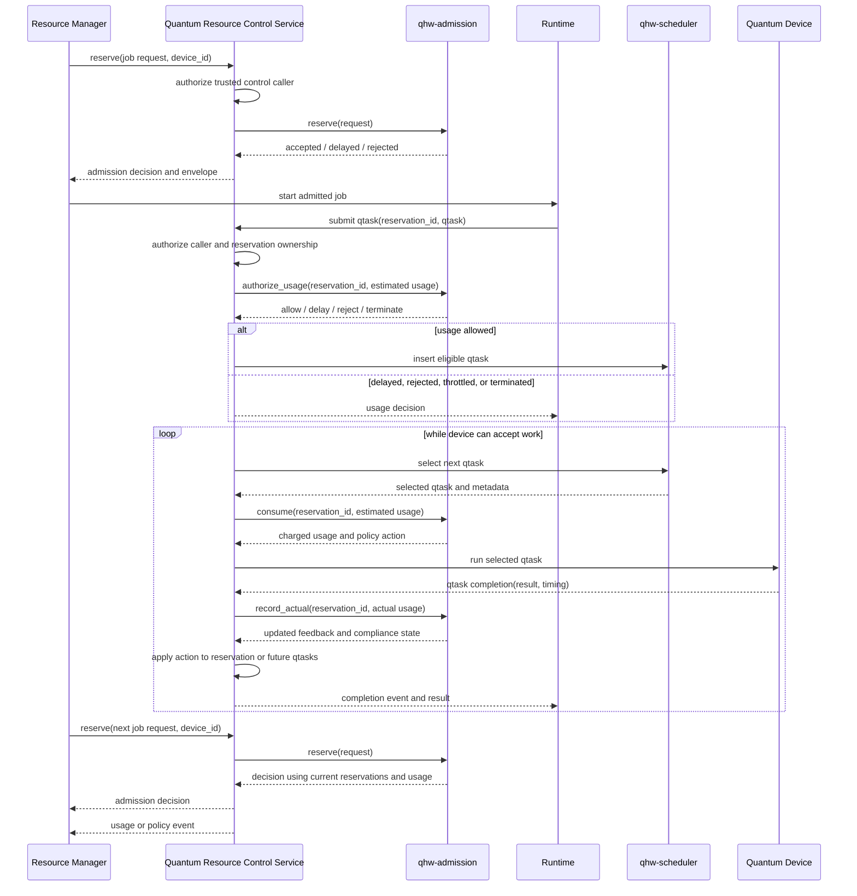

# qhw-admission Detailed Design

## Purpose

`qhw-admission` is a generic admission-control library for quantum resources.
It is the layer that decides whether a requested quantum workload should be
allowed to reserve capacity on a managed device. A single admission context can
manage one device or multiple devices. This allows the same library to run in a
small single-QPU service or in a Quantum Access Node that brokers access to
several quantum devices.

A caller submits a reservation request with workload metadata and a target
device identifier. The library evaluates that request against the matching
device profile, a resource estimator, the selected admission policy, and current
reservations for that device. The result is a structured admission decision.

The module provides quality-of-service control. It limits the active workload
accepted onto a quantum device, so downstream queues do not grow without bound.
It is intended for use by resource managers, runtime services, simulators, and
site-specific control planes.

The standard policy set includes three policies:

- `unlimited`: accept every internally valid request.
- `credit`: admit requests against a finite credit budget.
- `rate`: admit requests against a finite device throughput rate.

The implementation is written in C. The C API is the reference interface.
Python bindings should be generated with SWIG and wrapped in a small
Python package. CMake should build the C library, policy plugins,
estimators, C tests, SWIG extension, and Python tests.

## Quality Of Service Model

Admission control provides QoS by granting a bounded QPU usage envelope. The
library does not try to predict future quantum work perfectly. It estimates the
capacity needed by a request, admits that request only when the device can
absorb the demand, and records the capacity envelope that the runtime must
enforce as qtasks are submitted.

This differs from the classical walltime model. A classical job commonly holds
allocated CPUs or GPUs for the full walltime. A hybrid quantum job may use the
QPU intermittently while classical work runs between quantum calls. Reserving a
full QPU for the whole walltime would waste device capacity. Admission lets
multiple jobs share one QPU while limiting the active set so device queues do
not grow without bound.

Requests can describe demand at several levels of precision. A simple request
can provide a conservative envelope, such as maximum qtask shape and maximum
qtask count. A structured request can provide multiple qtask classes for finer
accounting. A measured request can use historical data from earlier runs to
provide better estimates. All three paths produce the same result: a bounded
reservation expressed in credits, rate units, estimated time, or policy-specific
capacity.

QoS depends on runtime enforcement. A job that submits more work than its
admitted envelope can consume capacity promised to other jobs. The runtime must
detect that condition through usage authorization and accounting. Policy can
then reject the excess task, delay it until capacity is available, throttle the
reservation, lower priority, charge additional capacity, or terminate the
reservation according to site rules.

Over-requesting also harms QoS because it holds capacity that other jobs could
use. The runtime should record unused reserved capacity when a reservation is
released or expires. Site policy can charge for reserved capacity, reduce future
reservation limits, lower confidence for future requests from the same workload,
or require renewal so idle reservations are reclaimed quickly.

The admission library should support feedback-driven estimator calibration. The
runtime should record estimated demand, admitted capacity, actual qtask usage,
unused capacity, overflow events, device timing, estimator version, and
workload metadata. Deterministic calibration should come before more complex
learning. Useful starting points include per-device safety margins, quantile
based correction factors, moving averages for repeated workloads, and
site-defined caps for low-confidence requests.

Reinforcement learning can be added as a policy or estimator plugin after
sufficient telemetry exists. A practical learning model would adjust margins or
choose estimator profiles, not bypass hard QoS limits. Its reward function
should penalize missed deadlines, queue growth, overuse, and idle reserved
capacity. The output still becomes an ordinary estimate and confidence value
consumed by admission policy.

## Runtime Interaction

The admission and scheduler libraries are passive. An active Quantum Resource
Control Service owns the device-facing state machine. The service can be a QPM
service, a Quantum Access Node service, or another runtime control process. It
exposes restricted admission/control APIs to trusted resource-manager or admin
components, and user-facing qtask APIs to applications and runtimes.

The service uses `qhw-admission` to decide whether a quantum job or hybrid job
can enter the active pool for a managed device. Accepted requests create an
admission envelope. The same service later receives qtask submissions,
authorizes each qtask against the envelope, and uses `qhw-scheduler` to order
eligible qtasks. Before a selected qtask is submitted to the device, the
service charges the estimated usage against the envelope. After completion, it
records measured usage for compliance and estimator feedback. The scheduler
library orders tasks. The service owns device events, authorization, and the
API boundary.

Admission/control APIs are control-plane APIs. Normal application code should
not be able to reserve capacity, release another job's reservation, renew a
reservation, or change policy. Those operations require a trusted caller such
as a resource-manager plugin, scheduler integration, site automation service,
or administrator. Runtime qtask APIs are data-plane APIs. They accept qtasks
only under an active reservation owned by the calling job or user.



## Scope

The library manages admission state for an admission service instance. A
context can register multiple device profiles keyed by `device_id`. Each device
has its own profile, estimator configuration, policy state, capacity counters,
and reservations. A single-device deployment is represented as one context with
one registered device.

The core library owns:

- device admission configuration
- device registry
- resource estimator configuration
- admission policy selection
- reservation accounting
- capacity accounting
- usage compliance accounting
- structured decision reporting
- optional task-level usage accounting

The caller owns:

- authentication
- resource-manager integration
- job launch
- scheduler integration
- provider submission
- result retrieval
- persistent storage

Admission decides whether a job or lease can enter the active set. Scheduling
decides which accepted quantum task occupies a QPU next.

## Design Goals

- Provide a C API that can be called from C, Python, resource-manager
  plugins, runtime services, and simulators.
- Keep admission policy separate from provider submission and task scheduling.
- Make workload payloads opaque. Admission operates on declared metadata and
  estimator outputs, not on provider-native circuit objects.
- Keep cost estimation pluggable. Different devices, providers, and sites can
  supply different estimators while using the same admission policies.
- Support deterministic evaluate and reserve operations. `evaluate()` is a
  dry run. `reserve()` atomically creates an admitted reservation.
- Return structured decisions that can be translated by external systems.
- Use policy plugins so site-specific admission policies can be added without
  changing the core library.
- Use SWIG for Python bindings.

## Repository Layout

The repository skeleton should stay small. Files should be added when the
implementation needs a separate compilation unit, not because the final design
might eventually grow there.

```text
qhw-admission/
  CMakeLists.txt
  pyproject.toml
  README.md
  LICENSE

  include/
    qhw_admission/
      qhw_admission.h
      qhw_admission_types.h

  external/
    qhw-datastructures/

  src/
    qhw_admission_internal.h
    qhw_admission.c
    qhw_reservation.c
    qhw_error.c
    qhw_thread.c

    policies/
      unlimited.c
      credit.c
      rate.c

    estimators/
      baseline.c

  swg/
    qhw_admission.i
    qhw_admission_typemaps.i

  python/
    qhw_admission/
      __init__.py
      admission.py

  tests/
    c/
      test_core.c
      test_unlimited.c
      test_credit.c
      test_rate.c
      test_estimator.c
      test_lifecycle.c
      test_threading.c

    python/
      test_unlimited.py
      test_credit.py
      test_rate.py
      test_estimator.py
      test_lifecycle.py

  docs/
    detailed-design.md
    design-notes.md
    qhw-admission-standard.md
    policies.md
```

`qhw_admission.h` should include the public API and
`qhw_admission_types.h` should define public data structures. Split
headers only when the public surface becomes large enough to justify it.

Estimators use the plugin interface from the start. The standard distribution
provides a baseline estimator plugin in `src/estimators/baseline.c`. Hardware
vendors and sites can provide additional estimator plugins with the same
descriptor interface.

The core should load estimator plugins from three places. Standard plugins are
installed under the qhw-admission prefix. External plugins can be loaded by
explicit path. A caller can also add search paths for site-installed plugins
when plugin names are selected through configuration.

`qhw-datastructures` is a git submodule under `external/`. The admission
implementation uses it for hash tables, heaps, lists, RB trees, rings, and
similar internal containers. The public admission API does not expose
qhw-datastructures types.

The README, detailed design, policy notes, and tests are the primary
documentation targets. Man pages belong with the finalized public API.

## Build System

CMake is the primary build system. It should build the core library, policy
plugins, estimator plugins, C tests, and SWIG-generated Python extension.
Python packaging should use `pyproject.toml` and `scikit-build-core`, matching
the direction used by `qhw-scheduler`.

CMake should add `external/qhw-datastructures` as a subdirectory and link the
admission core and tests against its exported target. This keeps shared
container logic in one repository and avoids local copies of hash tables,
heaps, lists, RB trees, or rings.

Build options should be explicit:

```text
QHW_ADM_BUILD_SHARED=ON|OFF
QHW_ADM_BUILD_STATIC=ON|OFF
QHW_ADM_BUILD_PLUGINS=ON|OFF
QHW_ADM_BUILD_ESTIMATORS=ON|OFF
QHW_ADM_BUILD_PYTHON=ON|OFF
QHW_ADM_BUILD_TESTS=ON|OFF
QHW_ADM_INSTALL_PLUGINS=ON|OFF
QHW_ADM_INSTALL_ESTIMATORS=ON|OFF
```

When `QHW_ADM_BUILD_PYTHON=ON`, CMake should require SWIG, a Python
interpreter, and matching Python development headers. A build without those
dependencies should fail with a direct diagnostic. C-only builds can set
`QHW_ADM_BUILD_PYTHON=OFF`.

The standard build should produce:

- `libqhw_admission.so`
- `libqhw_admission.a`, when static builds are enabled
- the `qhw-datastructures` library through the submodule build
- `qhw_adm_unlimited.so`
- `qhw_adm_credit.so`
- `qhw_adm_rate.so`
- `qhw_adm_estimator_baseline.so`
- SWIG-generated Python extension module
- C and Python tests

## Install Layout

The install target should use the selected CMake prefix.

```text
<prefix>/
  include/
    qhw_admission/
      qhw_admission.h
      qhw_admission_types.h
    qhw_datastructures/
      qhw_hash_table.h
      qhw_heap.h
      qhw_list.h
      qhw_rb_tree.h
      qhw_ring.h

  lib/
    libqhw_admission.so
    libqhw_admission.a
    libqhw_datastructures.so
    libqhw_datastructures.a

    qhw_admission/
      policies/
        qhw_adm_unlimited.so
        qhw_adm_credit.so
        qhw_adm_rate.so

      estimators/
        qhw_adm_estimator_baseline.so

    cmake/
      qhw_admission/
        qhw_admissionConfig.cmake
        qhw_admissionTargets.cmake

  lib/pkgconfig/
    qhw_admission.pc
```

## Core Data Model

The public data model is defined in `qhw_admission_types.h`. The field tables
in this section define the C fields in each public structure. Each public
descriptor begins with `struct_size` so implementations can validate the caller
view of the structure before reading fields.

The field tables in this section are normative ABI definitions. The public
header must define each structure with the fields shown here, in the order
shown here, using the listed C types. New fields are appended after existing
fields and are guarded by `struct_size` validation.

| Structure | Visibility | Purpose | Use |
|---|---|---|---|
| `qhw_adm_attr_t` | Public | Context creation options. | Passed to `qhw_adm_create()` to select threading mode and context-wide options. |
| `qhw_adm_value_t` | Public | Tagged scalar value used by metadata and options. | Carries one typed metadata or option value without forcing all extension values into strings. |
| `qhw_adm_kv_t` | Public | Key-value metadata or option entry. | Forms metadata and option arrays attached to requests, devices, qtask classes, policies, and estimators. |
| `qhw_adm_baseline_t` | Public | Baseline circuit shape used for credit and rate accounting. | Defines the reference workload unit used to convert estimates into credits or rate units. |
| `qhw_adm_device_profile_t` | Public | Device admission profile registered with a context. | Supplies the device limits, baseline, and policy capacity used when evaluating requests for a target device. |
| `qhw_adm_capacity_snapshot_t` | Public | Scheduler or device capacity projection supplied through a callback. | Lets the admission core incorporate live queue, reservation, and availability state owned by the control service. |
| `qhw_adm_capacity_view_t` | Public | Core-computed capacity view for one device and scope. | Combines the provider snapshot with the committed capacity ledger and supplies policy callbacks with normalized capacity inputs. |
| `qhw_adm_capacity_provider_t` | Public | Callback table used to obtain capacity snapshots. | Registered with the context so policies can request a fresh capacity projection during evaluation or reservation. |
| `qhw_adm_qtask_class_t` | Public | Resource-estimation shape for one class of qtasks. | Describes repeated quantum work in an admission request without requiring admission to parse task payloads. |
| `qhw_adm_request_t` | Public | Admission request submitted by the control service or resource manager. | Carries target device, owner, walltime, workload kind, qtask classes, and request metadata into `evaluate()` or `reserve()`. |
| `qhw_adm_estimate_t` | Public | Estimator output consumed by admission policies. | Reports estimated timing, baseline units, and confidence for the request or qtask class being evaluated. |
| `qhw_adm_decision_t` | Public | Structured admission or usage decision. | Returns accepted, delayed, rejected, retry, capacity, and diagnostic details to the caller. |
| `qhw_adm_reservation_t` | Public | Reservation state returned to callers. | Exposes the admitted capacity envelope, reservation lifecycle state, and accounting counters. |
| `qhw_adm_usage_t` | Public | Proposed or completed usage event. | Describes one qtask usage event that should be authorized, consumed, returned, or recorded. |
| `qhw_adm_usage_state_t` | Public | Aggregate reservation usage state. | Reports how much of an admitted reservation has been consumed and how much remains. |
| `qhw_adm_compliance_t` | Public | Overuse, underuse, and policy-action state. | Reports policy decisions tied to envelope violations or systematic underuse. |
| `qhw_adm_actual_usage_t` | Public | Measured usage record for feedback. | Feeds observed execution, compile, transfer, and control timing back into estimator calibration. |
| `qhw_adm_policy_grant_t` | Public plugin interface | Capacity grant proposed by a policy. | Filled by policy plugins during reserve planning. The core commits the grant after the pending reservation is complete and before publication. |
| `qhw_adm_policy_desc_t` | Public plugin interface | Policy plugin descriptor. | Exported by policy plugins so the core can create, configure, and invoke the admission algorithm. |
| `qhw_adm_estimator_desc_t` | Public plugin interface | Estimator plugin descriptor. | Exported by estimator plugins so the core can create, configure, and invoke resource-estimation logic. |

Internal structures include the context object, device registry entries,
reservation table nodes, copied metadata storage, lock objects, plugin registry
entries, and policy or estimator private state. Those structures are defined
only in private implementation headers.

### Metadata Values

Several public structures need extensible metadata. The public representation
uses a typed key-value array so requests, device profiles, qtask classes, and
policy options can carry extension values without changing the base structure.

| Structure | Visibility | Purpose | Use |
|---|---|---|---|
| `qhw_adm_kv_t` | Public | Generic key-value option and metadata entry. | Used anywhere the public API accepts extensible metadata or configuration. |
| `qhw_adm_value_t` | Public | Tagged scalar value used by key-value entries. | Carries one typed scalar in a `qhw_adm_kv_t` entry. |

Supported scalar types are unsigned integers, signed integers, doubles,
booleans, and strings. Binary values are an extension point for compact opaque
metadata.

The public C representation is:

```c
typedef enum qhw_adm_value_type {
	QHW_ADM_VALUE_U64 = 1,
	QHW_ADM_VALUE_I64 = 2,
	QHW_ADM_VALUE_F64 = 3,
	QHW_ADM_VALUE_BOOL = 4,
	QHW_ADM_VALUE_STRING = 5
} qhw_adm_value_type_t;

typedef struct qhw_adm_value {
	qhw_adm_value_type_t type;
	union {
		uint64_t u64;
		int64_t i64;
		double f64;
		bool boolean;
		const char *string;
	} data;
} qhw_adm_value_t;

typedef struct qhw_adm_kv {
	uint64_t key;
	qhw_adm_value_t value;
} qhw_adm_kv_t;
```

String values are borrowed for the duration of the public API call. The library
copies strings when a value is stored in context-owned state.

Metadata is part of the admission contract. The core request fields cover the
common near-term circuit shape, while metadata carries estimator inputs,
policy hints, and scheduler-derived capacity state. The admission core treats
payloads as opaque and relies on declared metadata instead of parsing provider
circuit formats.

Standard metadata keys should cover the information needed for resource
estimation and admission policy:

- Workload kind describes how the request should be interpreted. Standard
  values are `quantum_job` and `hybrid_job`. Quantum jobs submit qtasks without
  coupled classical resources waiting on QPU progress. Hybrid jobs submit qtasks
  while holding coupled classical resources, so delayed QPU progress can leave
  those resources idle.
- NISQ shape describes near-term circuit demand. Standard fields should cover
  qubit count, circuit depth, one-qubit gate count, two-qubit gate count,
  shots, and measurements. These fields let estimators compute execution time
  without parsing the circuit payload.
- FTQC shape describes fault-tolerant quantum workloads. Standard fields
  should cover logical qubits, logical depth or logical cycles, T-count,
  T-depth, target logical error rate, code family, code distance, magic-state
  demand, decoder overhead, and classical control overhead.
- Timing hints provide measured or caller-supplied costs when they are known.
  Standard fields should cover compile time, lowering time, transfer time,
  control-system setup time, measurement time, batching behavior, and
  provider-side fixed overheads.
- Policy hints describe how the request should be treated by admission policy.
  Standard fields should cover priority, deadline, requested QoS class, latest
  acceptable start time, latest acceptable finish time, and reservation scope.
- Feedback metadata records information used to calibrate future estimates.
  Standard fields should cover estimator version, observed device time, consumed
  credits, consumed rate, unused capacity, and over-limit events.

The public header defines these metadata keys:

```c
typedef enum qhw_adm_meta_key {
	QHW_ADM_META_WORKLOAD_KIND = 1,
	QHW_ADM_META_SESSION_ID = 2,
	QHW_ADM_META_SCOPE_ID = 3,
	QHW_ADM_META_DEADLINE_NS = 4,
	QHW_ADM_META_LATEST_START_NS = 5,
	QHW_ADM_META_LATEST_FINISH_NS = 6,
	QHW_ADM_META_QOS_CLASS = 7,
	QHW_ADM_META_LAYER_COUNT = 8,
	QHW_ADM_META_BATCH_COUNT = 9,
	QHW_ADM_META_PROVIDER_BATCHING = 10,
	QHW_ADM_META_COMPILE_NS = 11,
	QHW_ADM_META_LOWERING_NS = 12,
	QHW_ADM_META_TRANSFER_NS = 13,
	QHW_ADM_META_CONTROL_OVERHEAD_NS = 14,
	QHW_ADM_META_PROVIDER_OVERHEAD_NS = 15,
	QHW_ADM_META_ONE_Q_GATE_NS = 16,
	QHW_ADM_META_TWO_Q_GATE_NS = 17,
	QHW_ADM_META_MEASUREMENT_NS = 18,
	QHW_ADM_META_ONE_Q_GATE_TRANSFER_NS = 19,
	QHW_ADM_META_TWO_Q_GATE_TRANSFER_NS = 20,
	QHW_ADM_META_MEASUREMENT_TRANSFER_NS = 21,
	QHW_ADM_META_LOGICAL_QUBITS = 22,
	QHW_ADM_META_LOGICAL_CYCLES = 23,
	QHW_ADM_META_T_COUNT = 24,
	QHW_ADM_META_T_DEPTH = 25,
	QHW_ADM_META_TARGET_LOGICAL_ERROR_PPM = 26,
	QHW_ADM_META_CODE_FAMILY = 27,
	QHW_ADM_META_CODE_DISTANCE = 28,
	QHW_ADM_META_MAGIC_STATE_COUNT = 29,
	QHW_ADM_META_DECODER_OVERHEAD_NS = 30,
	QHW_ADM_META_CLASSICAL_CONTROL_OVERHEAD_NS = 31,
	QHW_ADM_META_ESTIMATOR_VERSION = 32,
	QHW_ADM_META_OBSERVED_DEVICE_NS = 33,
	QHW_ADM_META_CONSUMED_CREDITS = 34,
	QHW_ADM_META_CONSUMED_RATE = 35,
	QHW_ADM_META_UNUSED_CAPACITY = 36,
	QHW_ADM_META_OVER_LIMIT_EVENTS = 37
} qhw_adm_meta_key_t;
```

| Key | Purpose |
|---|---|
| `QHW_ADM_META_WORKLOAD_KIND` | Quantum-job or hybrid-job interpretation. |
| `QHW_ADM_META_SESSION_ID` | External session or workflow identifier. |
| `QHW_ADM_META_SCOPE_ID` | Site-defined accounting or policy scope. |
| `QHW_ADM_META_DEADLINE_NS` | Deadline associated with the reservation request. |
| `QHW_ADM_META_LATEST_START_NS` | Latest acceptable projected start time. |
| `QHW_ADM_META_LATEST_FINISH_NS` | Latest acceptable projected finish time. |
| `QHW_ADM_META_QOS_CLASS` | Site-defined QoS class. |
| `QHW_ADM_META_LAYER_COUNT` | Additional NISQ circuit-layer count. |
| `QHW_ADM_META_BATCH_COUNT` | Number of batches expected by the workload. |
| `QHW_ADM_META_PROVIDER_BATCHING` | Provider-side batching mode or hint. |
| `QHW_ADM_META_COMPILE_NS` | Estimated or measured compilation time. |
| `QHW_ADM_META_LOWERING_NS` | Estimated or measured lowering time. |
| `QHW_ADM_META_TRANSFER_NS` | Estimated or measured transfer time. |
| `QHW_ADM_META_CONTROL_OVERHEAD_NS` | Fixed control-system overhead. |
| `QHW_ADM_META_PROVIDER_OVERHEAD_NS` | Provider-side fixed overhead. |
| `QHW_ADM_META_ONE_Q_GATE_NS` | Default one-qubit gate duration. |
| `QHW_ADM_META_TWO_Q_GATE_NS` | Default two-qubit gate duration. |
| `QHW_ADM_META_MEASUREMENT_NS` | Default measurement duration. |
| `QHW_ADM_META_ONE_Q_GATE_TRANSFER_NS` | Default one-qubit gate transfer cost. |
| `QHW_ADM_META_TWO_Q_GATE_TRANSFER_NS` | Default two-qubit gate transfer cost. |
| `QHW_ADM_META_MEASUREMENT_TRANSFER_NS` | Default measurement transfer cost. |
| `QHW_ADM_META_LOGICAL_QUBITS` | Logical qubits required by an FTQC workload. |
| `QHW_ADM_META_LOGICAL_CYCLES` | Logical cycles or logical depth. |
| `QHW_ADM_META_T_COUNT` | T-count for FTQC estimation. |
| `QHW_ADM_META_T_DEPTH` | T-depth for FTQC estimation. |
| `QHW_ADM_META_TARGET_LOGICAL_ERROR_PPM` | Target logical error rate. |
| `QHW_ADM_META_CODE_FAMILY` | Error-correction code family. |
| `QHW_ADM_META_CODE_DISTANCE` | Error-correction code distance. |
| `QHW_ADM_META_MAGIC_STATE_COUNT` | Magic-state demand. |
| `QHW_ADM_META_DECODER_OVERHEAD_NS` | Decoder-side classical overhead. |
| `QHW_ADM_META_CLASSICAL_CONTROL_OVERHEAD_NS` | Runtime classical control overhead. |
| `QHW_ADM_META_ESTIMATOR_VERSION` | Estimator identity used for feedback records. |
| `QHW_ADM_META_OBSERVED_DEVICE_NS` | Measured device time from a completed reservation or qtask. |
| `QHW_ADM_META_CONSUMED_CREDITS` | Credits consumed by actual usage. |
| `QHW_ADM_META_CONSUMED_RATE` | Rate consumed by actual usage. |
| `QHW_ADM_META_UNUSED_CAPACITY` | Capacity reserved but returned unused. |
| `QHW_ADM_META_OVER_LIMIT_EVENTS` | Count of usage events that exceeded the admitted envelope. |

`QHW_ADM_META_WORKLOAD_KIND` maps to standard values:

| Value | Meaning |
|---|---|
| `QHW_ADM_WORKLOAD_QUANTUM_JOB` | The request describes a quantum-only job that may submit one or more qtasks. |
| `QHW_ADM_WORKLOAD_HYBRID_JOB` | The request describes the maximum quantum demand expected during a hybrid job. |

Quantum-job requests describe quantum-only work that does not hold coupled
classical resources while waiting for QPU progress. Hybrid-job requests describe
an upper bound for all quantum work expected during the job walltime. Admission
evaluates the full envelope before the application starts, then usage
accounting enforces the admitted capacity as qtasks are submitted.

Batches and workflows are represented above the admission layer. A batch runner
can submit a quantum-job request or request a hybrid-job envelope for the whole
batch. A workflow manager can decompose a graph into quantum-job and hybrid-job
requests. The device-facing admission layer only evaluates the quantum work
presented through those two workload kinds.

FTQC estimators consume different metadata than NISQ estimators. A
fault-tolerant estimator may translate logical qubits, logical cycles, T-count,
T-depth, code distance, magic-state demand, decoder overhead, and target error
rate into physical time and baseline units. This keeps FTQC support in
estimator plugins while preserving the same admission policy interface.

Admission policies also need projected device state. The admission core obtains
that state through a capacity-provider callback that returns a standard
snapshot:

```c
typedef qhw_adm_rc_t (*qhw_adm_get_capacity_snapshot_fn)(
	uint64_t device_id,
	uint64_t scope_id,
	qhw_adm_capacity_snapshot_t *out_snapshot,
	void *user_data);

typedef struct qhw_adm_capacity_provider {
	size_t struct_size;
	qhw_adm_get_capacity_snapshot_fn get_snapshot;
	void *user_data;
} qhw_adm_capacity_provider_t;
```

| Structure | Purpose | Use |
|---|---|---|
| `qhw_adm_capacity_provider_t` | Holds the callback used to obtain projected capacity state. | The caller registers it with `qhw_adm_set_capacity_provider()` so the admission core can ask the control service for live device or scheduler state. |
| `qhw_adm_capacity_snapshot_t` | Holds one external capacity projection for a device and policy scope. | Returned by the provider callback and merged with the core ledger before policy evaluation. |
| `qhw_adm_capacity_view_t` | Holds the capacity state visible to admission policies. | Built by the core from the capacity snapshot, registered device profile, and committed reservation ledger. |

`qhw_adm_capacity_snapshot_t` contains:

| Field | C type | Meaning |
|---|---|---|
| `struct_size` | `size_t` | Size of the structure supplied by the caller. |
| `device_id` | `uint64_t` | Device described by the snapshot. |
| `scope_id` | `uint64_t` | Scope described by the snapshot. |
| `device_state` | `qhw_adm_device_state_t` | Device availability used by admission decisions. |
| `now_ns` | `uint64_t` | Timestamp used for projected capacity and timing values. |
| `next_available_ns` | `uint64_t` | Earliest projected time that newly admitted work can start. |
| `queued_baseline_units` | `uint64_t` | Queued work expressed in baseline units. |
| `queued_estimated_ns` | `uint64_t` | Queued work expressed as estimated device time. |
| `active_reservation_count` | `uint64_t` | Number of reservations that hold capacity. |
| `external_credit_limit` | `uint64_t` | Optional total credit cap for the evaluated scope. Zero means no external credit cap. |
| `external_rate_limit` | `uint64_t` | Optional total rate cap for the evaluated scope. Zero means no external rate cap. |
| `scheduler_policy_id` | `uint64_t` | Identifier for the active scheduler policy. |
| `confidence_ppm` | `uint32_t` | Confidence in the projection. |
| `metadata` | `const qhw_adm_kv_t *` | Scheduler or device-specific extension values. |
| `metadata_count` | `size_t` | Number of metadata entries. |

The callback lets `qhw-admission` use live scheduler and device state without
depending on a specific scheduler implementation. A runtime can populate the
snapshot from `qhw-scheduler`, a simulator, a vendor service, telemetry, or a
site-specific control plane.

The admission core owns committed capacity state. It tracks total, reserved,
consumed, returned, and available credits or rate units for each registered
device and scope. The capacity provider does not commit reservations and does
not own the admission ledger. Its snapshot is read-only input used for device
availability, projected queue delay, and optional external caps.

The core builds `qhw_adm_capacity_view_t` before calling a policy. The view
contains the provider projection and the committed ledger fields needed by
credit and rate policies.

| Field | C type | Meaning |
|---|---|---|
| `struct_size` | `size_t` | Size of the structure supplied by the core. |
| `device_id` | `uint64_t` | Device described by the view. |
| `scope_id` | `uint64_t` | Scope described by the view. |
| `device_state` | `qhw_adm_device_state_t` | Device availability used by admission decisions. |
| `now_ns` | `uint64_t` | Timestamp used for projected capacity and timing values. |
| `next_available_ns` | `uint64_t` | Earliest projected time that newly admitted work can start. |
| `queued_baseline_units` | `uint64_t` | Queued work expressed in baseline units. |
| `queued_estimated_ns` | `uint64_t` | Queued work expressed as estimated device time. |
| `active_reservation_count` | `uint64_t` | Number of active reservations that hold capacity on the device. |
| `total_credits` | `uint64_t` | Total credit capacity available to the credit policy. This value is either configured directly or derived from the baseline circuit and accounting window. |
| `credits_reserved` | `uint64_t` | Device-wide credits reserved in the core ledger. |
| `credits_consumed` | `uint64_t` | Device-wide credits consumed in the core ledger. |
| `credits_returned` | `uint64_t` | Device-wide credits returned in the core ledger. |
| `core_available_credits` | `uint64_t` | Credits available from the core ledger before external scope caps. |
| `external_credit_limit` | `uint64_t` | Optional total credit cap supplied by the capacity provider for the evaluated scope. |
| `scoped_reserved_credits` | `uint64_t` | Credits already reserved in the evaluated scope. |
| `effective_available_credits` | `uint64_t` | Credits available after applying core availability and scoped external caps. |
| `total_rate` | `uint64_t` | Total rate capacity configured for the device. |
| `rate_reserved` | `uint64_t` | Device-wide rate units reserved in the core ledger. |
| `rate_consumed` | `uint64_t` | Device-wide rate units consumed in the core ledger. |
| `rate_returned` | `uint64_t` | Device-wide rate units returned in the core ledger. |
| `core_available_rate` | `uint64_t` | Rate available from the core ledger before external scope caps. |
| `external_rate_limit` | `uint64_t` | Optional total rate cap supplied by the capacity provider for the evaluated scope. |
| `scoped_reserved_rate` | `uint64_t` | Rate already reserved in the evaluated scope. |
| `effective_available_rate` | `uint64_t` | Rate available after applying core availability and scoped external caps. |
| `scheduler_policy_id` | `uint64_t` | Identifier for the active scheduler policy. |
| `confidence_ppm` | `uint32_t` | Confidence in timing and capacity projections. |
| `metadata` | `const qhw_adm_kv_t *` | Provider, scheduler, or policy extension values copied by the core. |
| `metadata_count` | `size_t` | Number of metadata entries. |

External caps are total limits for the evaluated scope, not already-available
capacity. The core computes remaining scoped external capacity by subtracting
the core ledger's active reservations for that same `(device_id, scope_id)`.
Policies evaluate against the smaller of device-wide core availability and the
remaining scoped external capacity.

The capacity view carries both device-wide and scope-local counters.
`credits_reserved`, `credits_consumed`, `credits_returned`, `rate_reserved`,
`rate_consumed`, and `rate_returned` are device-wide ledger values. The
`scoped_reserved_*` fields are the scope-local values used only when applying
external scope caps. `core_available_*` is always derived from device-wide
capacity before scoped external caps are applied. `effective_available_*` is
the value left after applying those caps.

Capacity provider metadata is returned in provider-owned memory. The provider
keeps that memory stable until the public admission API call that invoked the
provider returns. The core deep-copies the metadata into temporary core-owned
storage before policy evaluation. Policy callbacks read the copied metadata for
the duration of the public API call. A policy that stores metadata beyond the
callback must make its own copy.

Admission timing guidance is reservation-level. An accepted decision should
include a projected start time, finish time, and confidence value for the
admitted envelope. The scheduler owns task-level timing guidance. When a task
is submitted under a reservation, the scheduler can return a more specific
estimated start time and estimated device occupancy for that task. Workload
managers can use those projections to decide when classical resources should be
allocated or held.

### Baseline Circuit Shape

The baseline circuit shape is the reference unit for credit and rate
accounting. It is represented by `qhw_adm_baseline_t`. A device rate is
expressed in baseline units per time span.

| Field | C type | Meaning |
|---|---|---|
| `struct_size` | `size_t` | Size of the structure supplied by the caller. |
| `qubit_count` | `uint32_t` | Number of qubits in the baseline circuit. |
| `depth` | `uint64_t` | Circuit depth used as a scaling reference. |
| `one_q_gate_count` | `uint64_t` | Number of one-qubit gates. |
| `two_q_gate_count` | `uint64_t` | Number of two-qubit gates. |
| `shots` | `uint64_t` | Number of shots. |
| `measurement_count` | `uint64_t` | Number of measurements or measured qubits. |

The baseline shape is configurable because each site needs a practical unit of
accounting. A device may choose a small benchmark circuit, a representative
production circuit, or a conservative default.

### Device Profile

The device profile describes one admission target. It is represented by
`qhw_adm_device_profile_t` and registered with the admission context before
requests can target the device.

| Field | C type | Meaning |
|---|---|---|
| `struct_size` | `size_t` | Size of the structure supplied by the caller. |
| `device_id` | `uint64_t` | Local numeric device identifier. |
| `time_span_ns` | `uint64_t` | Accounting window used to derive credit capacity and rate capacity when explicit values are not configured. |
| `baseline` | `qhw_adm_baseline_t` | Baseline circuit shape. |
| `max_qubits` | `uint32_t` | Maximum supported qubit count. |
| `max_shots` | `uint64_t` | Maximum shots per task, if known. |
| `one_q_gate_ns` | `uint64_t` | Default one-qubit gate duration used by the generic near-term estimator. |
| `two_q_gate_ns` | `uint64_t` | Default two-qubit gate duration used by the generic near-term estimator. |
| `measurement_ns` | `uint64_t` | Default measurement duration used by the generic near-term estimator. |
| `one_q_gate_transfer_ns` | `uint64_t` | Default transfer cost associated with one-qubit gate work. |
| `two_q_gate_transfer_ns` | `uint64_t` | Default transfer cost associated with two-qubit gate work. |
| `measurement_transfer_ns` | `uint64_t` | Default transfer cost associated with measurement work. |
| `compile_ns` | `uint64_t` | Default compile or lowering cost for a request. |
| `control_overhead_ns` | `uint64_t` | Default control-system setup overhead. |
| `provider_overhead_ns` | `uint64_t` | Default provider-side fixed overhead. |
| `total_credits` | `uint64_t` | Explicit credit capacity for the credit policy. A zero value asks the core to derive credit capacity from `time_span_ns` and the baseline estimate. |
| `device_rate` | `uint64_t` | Baseline units per time span for rate policy. |
| `concurrent_jobs` | `uint32_t` | Target concurrency for rate-slice defaults. |
| `default_ttl_ns` | `uint64_t` | Default reservation lease duration when the request does not provide one. |
| `metadata` | `const qhw_adm_kv_t *` | Device-specific values used by estimators or policies. |
| `metadata_count` | `size_t` | Number of metadata entries. |

If `total_credits` is zero, the core derives credit capacity while constructing
`qhw_adm_capacity_view_t`. The selected estimator computes the time required
for the registered baseline circuit. The core then counts how many complete
baseline units fit in `time_span_ns`:

```text
estimated_baseline_ns = estimator(device_profile, baseline_circuit)
total_credits = floor(time_span_ns / estimated_baseline_ns)
```

An explicit nonzero `total_credits` takes precedence over the derived value.
The derived value must be greater than zero for the credit policy to admit
work.

If `device_rate` is zero, the core derives it while constructing
`qhw_adm_capacity_view_t`. The core uses the selected estimator, the registered
baseline circuit, and `time_span_ns` to compute a concrete `total_rate` before
it calls a policy callback:

```text
total_rate = ceil(time_span_ns / estimated_baseline_ns)
```

The implementation can cache the derived rate using the device profile version,
estimator version, and baseline shape. Replacing the profile or estimator
invalidates the cached value.

### Admission Request

An admission request describes the expected quantum demand of a job, lease, or
session. It is represented by `qhw_adm_request_t`. It contains one or more
qtask class descriptors that describe the quantum work covered by the request.

| Field | C type | Meaning |
|---|---|---|
| `struct_size` | `size_t` | Size of the structure supplied by the caller. |
| `request_id` | `uint64_t` | Caller-generated request identifier. |
| `device_id` | `uint64_t` | Target device registered in the admission context. |
| `user_id` | `uint64_t` | User, account, or tenant identifier. |
| `job_id` | `uint64_t` | External job identifier, if available. |
| `scope_id` | `uint64_t` | Site-defined accounting or policy scope. Zero means device-wide scope. |
| `reservation_id` | `uint64_t` | Optional caller-provided reservation identifier. Zero asks the core to generate one. |
| `workload_kind` | `qhw_adm_workload_kind_t` | Quantum-job or hybrid-job request type. |
| `walltime_ns` | `uint64_t` | Requested job walltime. |
| `ttl_ns` | `uint64_t` | Requested reservation lease duration. Zero selects the default TTL rule. |
| `classical_runtime_ns` | `uint64_t` | Expected non-QPU runtime. |
| `overhead_ns` | `uint64_t` | Runtime overhead subtracted from quantum budget. |
| `priority` | `int64_t` | Optional admission priority. |
| `task_class_count` | `size_t` | Number of qtask classes. |
| `task_classes` | `const qhw_adm_qtask_class_t *` | Array of qtask class descriptors. |
| `metadata` | `const qhw_adm_kv_t *` | Request-level metadata. |
| `metadata_count` | `size_t` | Number of metadata entries. |

The quantum budget is:

```text
quantum_budget_ns = walltime_ns - classical_runtime_ns - overhead_ns
```

The core computes `quantum_budget_ns` with checked unsigned arithmetic.
Requests where `classical_runtime_ns + overhead_ns` overflows or where
`walltime_ns <= classical_runtime_ns + overhead_ns` are invalid and return a
rejected decision with `QHW_ADM_REASON_WALLTIME_INFEASIBLE`. No policy sees a
wrapped quantum budget.

A caller-provided `reservation_id` must be nonzero and unique within the
admission context. A zero `reservation_id` requests automatic allocation. The
core-generated reservation ID is nonzero, unique within the context, and
returned in `qhw_adm_decision_t.reservation_id` for accepted reservations.

### Qtask Class

Admission control needs enough job metadata to calculate the credits or rate
required by a request. A qtask class is the structure that carries that
metadata for a qtask shape. It gives the caller a granular way to describe the
quantum work in the parent admission request.

Workload kind describes the admission request type. Qtask classes describe the
quantum work inside that request.

A quantum-job request can contain one or more qtask classes. A hybrid-job
request can also contain one or more qtask classes. Each class represents one
qtask shape expected during the job.

A request can use one class as a conservative envelope. In that mode, the class
describes the maximum qtask shape the job expects to submit, and `count` is the
maximum number of qtasks covered by the reservation. A caller with more workload
knowledge can provide multiple classes for finer accounting. Multiple classes
reduce over-reservation when most qtasks are smaller than the largest expected
qtask.

| Field | C type | Meaning |
|---|---|---|
| `struct_size` | `size_t` | Size of the structure supplied by the caller. |
| `class_id` | `uint64_t` | Caller-defined identifier for diagnostics and decision records. |
| `count` | `uint64_t` | Number of qtasks with this shape. |
| `qubit_count` | `uint32_t` | Expected or maximum qubit count. |
| `depth` | `uint64_t` | Expected or maximum circuit depth. |
| `one_q_gate_count` | `uint64_t` | Expected one-qubit gate count. |
| `two_q_gate_count` | `uint64_t` | Expected two-qubit gate count. |
| `shots` | `uint64_t` | Expected shot count. |
| `measurement_count` | `uint64_t` | Expected measurement count. |
| `metadata` | `const qhw_adm_kv_t *` | Estimator-specific extension inputs. |
| `metadata_count` | `size_t` | Number of metadata entries. |

Common qtask class entries include:

| Class entry | Use |
|---|---|
| Exact qtask | One qtask with known metadata and `count = 1`. |
| Repeated NISQ shape | Many qtasks with the same near-term circuit shape. |
| Conservative NISQ envelope | Many qtasks charged at the maximum expected near-term shape. |
| FTQC logical shape | One or more logical workloads described through FTQC metadata. |

Multiple qtask classes allow a request to represent a mixed workload without
charging every qtask at the maximum observed size. If every qtask has a
different shape, the caller can provide several classes or use a conservative
envelope class.

### Estimate

An estimate is the resource model produced from an admission request and a
device profile. The estimator reads the request's qtask classes, request
metadata, device profile, baseline circuit shape, and estimator configuration.
It returns the projected time and accounting values used by admission policy.

| Field | C type | Meaning |
|---|---|---|
| `struct_size` | `size_t` | Size of the structure supplied by the caller. |
| `execution_ns` | `uint64_t` | Estimated QPU execution time. |
| `measurement_ns` | `uint64_t` | Estimated measurement contribution. |
| `compile_ns` | `uint64_t` | Estimated compilation or lowering time. |
| `transfer_ns` | `uint64_t` | Estimated transfer time to the control system. |
| `control_overhead_ns` | `uint64_t` | Estimated control-system setup overhead. |
| `total_ns` | `uint64_t` | Total estimated time used for admission. |
| `baseline_units` | `uint64_t` | Work expressed in baseline-circuit units. |
| `confidence_ppm` | `uint32_t` | Optional confidence in parts per million. |

When an estimator returns `baseline_units = 0`, the core derives baseline
units from total time:

```text
baseline_units = ceil(total_ns / estimated_baseline_ns)
```

### Decision

Admission returns a structured decision.

| Value | Meaning |
|---|---|
| `QHW_ADM_DECISION_ACCEPTED` | The request was admitted. |
| `QHW_ADM_DECISION_DELAYED` | The request fits the device but capacity is unavailable. |
| `QHW_ADM_DECISION_REJECTED` | The request cannot be supported. |

The decision object is represented by `qhw_adm_decision_t`.

| Field | C type | Meaning |
|---|---|---|
| `struct_size` | `size_t` | Size of the structure supplied by the caller. |
| `decision` | `qhw_adm_decision_kind_t` | Accepted, delayed, or rejected result. |
| `request_id` | `uint64_t` | Request associated with the decision. |
| `device_id` | `uint64_t` | Device evaluated by the decision. |
| `scope_id` | `uint64_t` | Scope used for capacity accounting. |
| `reservation_id` | `uint64_t` | Reservation created for accepted requests. |
| `reason_code` | `uint64_t` | Machine-readable reason. |
| `credits_required` | `uint64_t` | Credit demand for the request. |
| `rate_required` | `uint64_t` | Rate demand for the request. |
| `capacity_available` | `uint64_t` | Available capacity at decision time. |
| `estimated_total_ns` | `uint64_t` | Estimated total quantum demand. |
| `estimated_start_ns` | `uint64_t` | Projected start time for the admitted envelope. |
| `estimated_finish_ns` | `uint64_t` | Projected finish time for the admitted envelope. |
| `latest_finish_ns` | `uint64_t` | Latest finish time allowed by the request or policy. |
| `quantum_budget_ns` | `uint64_t` | Available quantum budget. |
| `capacity_granted` | `uint64_t` | Capacity granted by the selected policy. |
| `compliance_action` | `qhw_adm_compliance_action_t` | Action applied when requested or observed use violates policy. |
| `retry_after_ns` | `uint64_t` | Optional retry hint. |
| `confidence_ppm` | `uint32_t` | Confidence in timing and capacity projections. |
| `message` | `const char *` | Human-readable diagnostic text owned by the context. |
| `metadata` | `const qhw_adm_kv_t *` | Policy-specific decision metadata. |
| `metadata_count` | `size_t` | Number of metadata entries. |

### Reservation

A reservation records capacity held for an accepted request. It is represented
by `qhw_adm_reservation_t`.

| Field | C type | Meaning |
|---|---|---|
| `struct_size` | `size_t` | Size of the structure supplied by the caller. |
| `reservation_id` | `uint64_t` | Reservation identifier. |
| `request_id` | `uint64_t` | Request that created the reservation. |
| `device_id` | `uint64_t` | Device that accepted the reservation. |
| `scope_id` | `uint64_t` | Scope charged by the reservation. |
| `user_id` | `uint64_t` | User, account, or tenant identifier. |
| `job_id` | `uint64_t` | External job identifier, if available. |
| `workload_kind` | `qhw_adm_workload_kind_t` | Quantum-job or hybrid-job request type. |
| `state` | `qhw_adm_reservation_state_t` | Pending, active, released, expired, or cancelled. |
| `credits_reserved` | `uint64_t` | Credits held by credit policy. |
| `credits_consumed` | `uint64_t` | Credits consumed by task-level accounting. |
| `rate_reserved` | `uint64_t` | Rate units held by rate policy. |
| `rate_consumed` | `uint64_t` | Rate units consumed by task-level accounting. |
| `quantum_budget_ns` | `uint64_t` | Quantum budget copied from the accepted request and used for rate usage accounting. |
| `device_profile_version` | `uint64_t` | Device profile version used when the reservation was created. |
| `policy_version` | `uint64_t` | Policy instance version used when the reservation was created. |
| `estimator_version` | `uint64_t` | Estimator instance version used when the reservation was created. |
| `estimated_total_ns` | `uint64_t` | Estimated quantum demand. |
| `actual_total_ns` | `uint64_t` | Actual accounted quantum usage. |
| `unused_capacity` | `uint64_t` | Reserved capacity returned unused at release or expiration. |
| `overuse_count` | `uint64_t` | Number of tasks or usage events that exceeded the envelope. |
| `underuse_score` | `uint64_t` | Policy-defined measure of systematic over-requesting. |
| `created_at_ns` | `uint64_t` | Creation timestamp. |
| `expires_at_ns` | `uint64_t` | Lease expiration time. |
| `metadata` | `const qhw_adm_kv_t *` | Reservation metadata copied from the request or policy. |
| `metadata_count` | `size_t` | Number of metadata entries. |

Reservation lifecycle is deterministic:

| Operation | Valid source state | Result state | Idempotency |
|---|---|---|---|
| `reserve()` | none | `QHW_ADM_RESERVATION_ACTIVE` | A duplicate nonzero caller-provided `reservation_id` returns `QHW_ADM_ERR_EXISTS`. |
| `release()` | `ACTIVE` | `RELEASED` | Releasing an already released reservation returns `QHW_ADM_OK`. |
| `cancel()` | `ACTIVE` | `CANCELLED` | Cancelling an already cancelled reservation returns `QHW_ADM_OK`. |
| `renew()` | `ACTIVE` | `ACTIVE` | Renewal of a terminal reservation returns `QHW_ADM_ERR_STATE`. |
| `expire()` | `ACTIVE` with `expires_at_ns <= now_ns` | `EXPIRED` | A reservation is counted as expired once. |

`RELEASED`, `CANCELLED`, and `EXPIRED` are terminal states. `release()` or
`cancel()` on a different terminal state returns `QHW_ADM_ERR_STATE`. Lookup
APIs can return terminal reservations until the context is destroyed or a
future pruning API removes archived records.

`created_at_ns` is taken from the capacity snapshot `now_ns` used by the
reserve transaction. When no capacity provider is registered or the snapshot
sets `now_ns = 0`, the context clock supplies `created_at_ns`.

The reservation TTL is selected in this order:

1. `qhw_adm_policy_grant_t.ttl_ns`
2. `qhw_adm_request_t.ttl_ns`
3. `qhw_adm_request_t.walltime_ns`
4. `qhw_adm_device_profile_t.default_ttl_ns`
5. no library-managed expiration when all values are zero

`expires_at_ns` is `created_at_ns + ttl_ns` when a TTL is selected. A zero
`expires_at_ns` means `qhw_adm_expire()` does not expire the reservation.
`qhw_adm_renew()` sets `expires_at_ns = now_ns + ttl_ns` and requires a
positive TTL.

`qhw_adm_expire(ctx, 0, out_expired_count)` uses the context clock as `now_ns`.
A nonzero `now_ns` uses the caller-provided timestamp.

### Usage Accounting Structures

Usage accounting is the public structure set used by a control service to
enforce an admitted envelope while qtasks execute. The service calls these APIs
when it needs the admission library to authorize, consume, return, or record
reservation capacity.

| Structure | Visibility | Purpose | Use |
|---|---|---|---|
| `qhw_adm_usage_t` | Public | Describes one proposed or completed qtask usage event. | Passed to authorization, consume, and return APIs when the control service enforces a reservation envelope. |
| `qhw_adm_usage_state_t` | Public | Reports aggregate usage for one reservation. | Returned by `qhw_adm_get_usage()` for runtime diagnostics, accounting, and operator visibility. |
| `qhw_adm_compliance_t` | Public | Reports overuse, underuse, and policy action state. | Returned by `qhw_adm_get_compliance()` so the control service can react to policy violations. |
| `qhw_adm_actual_usage_t` | Public | Carries measured usage for estimator feedback. | Passed to `qhw_adm_record_actual()` after qtask execution or reservation completion. |

`qhw_adm_usage_t` contains:

| Field | C type | Meaning |
|---|---|---|
| `struct_size` | `size_t` | Size of the structure supplied by the caller. |
| `reservation_id` | `uint64_t` | Reservation charged by the event. |
| `task_id` | `uint64_t` | Runtime qtask identifier, if available. |
| `class_id` | `uint64_t` | Qtask class that best describes the event. |
| `event_time_ns` | `uint64_t` | Timestamp used for rate-window accounting. Zero asks the context clock to supply the timestamp. |
| `estimated_ns` | `uint64_t` | Estimated device time for the event. |
| `actual_ns` | `uint64_t` | Measured device time when known. |
| `baseline_units` | `uint64_t` | Work expressed in baseline units. |
| `credits` | `uint64_t` | Credits charged or returned. |
| `rate_units` | `uint64_t` | Rate units charged or returned. |
| `metadata` | `const qhw_adm_kv_t *` | Event-specific metadata. |
| `metadata_count` | `size_t` | Number of metadata entries. |

`qhw_adm_usage_state_t` contains:

| Field | C type | Meaning |
|---|---|---|
| `struct_size` | `size_t` | Size of the structure supplied by the caller. |
| `reservation_id` | `uint64_t` | Reservation being reported. |
| `credits_reserved` | `uint64_t` | Credits admitted for the reservation. |
| `credits_consumed` | `uint64_t` | Credits consumed so far. |
| `rate_reserved` | `uint64_t` | Rate units admitted for the reservation. |
| `rate_consumed` | `uint64_t` | Rate units consumed so far. |
| `estimated_total_ns` | `uint64_t` | Estimated total device time. |
| `actual_total_ns` | `uint64_t` | Actual recorded device time. |
| `remaining_credits` | `uint64_t` | Credits still available under the reservation. |
| `remaining_rate` | `uint64_t` | Rate units still available under the reservation. |

`qhw_adm_compliance_t` contains:

| Field | C type | Meaning |
|---|---|---|
| `struct_size` | `size_t` | Size of the structure supplied by the caller. |
| `reservation_id` | `uint64_t` | Reservation being reported. |
| `overuse_count` | `uint64_t` | Number of over-limit events. |
| `underuse_score` | `uint64_t` | Policy-defined underuse score. |
| `unused_capacity` | `uint64_t` | Reserved capacity returned unused. |
| `action` | `qhw_adm_compliance_action_t` | Policy action selected for the current state. |
| `message` | `const char *` | Human-readable diagnostic text owned by the context. |

`qhw_adm_actual_usage_t` contains:

| Field | C type | Meaning |
|---|---|---|
| `struct_size` | `size_t` | Size of the structure supplied by the caller. |
| `reservation_id` | `uint64_t` | Reservation associated with the measurement. |
| `task_id` | `uint64_t` | Runtime qtask identifier, if available. |
| `observed_device_ns` | `uint64_t` | Measured device occupancy. |
| `observed_compile_ns` | `uint64_t` | Measured compilation or lowering time. |
| `observed_transfer_ns` | `uint64_t` | Measured transfer time. |
| `observed_control_overhead_ns` | `uint64_t` | Measured control overhead. |
| `metadata` | `const qhw_adm_kv_t *` | Feedback metadata. |
| `metadata_count` | `size_t` | Number of metadata entries. |

## Resource Estimator Plugin Interface

The estimator converts task metadata into timing and baseline-unit estimates.
It is a plugin surface because cost differs across hardware, control systems,
compilation paths, calibration state, and site policy.

For near-term gate-model systems, the generic baseline estimator can use one
calculation model across different devices. Device-specific behavior comes from
the registered device profile and estimator options. Characterization workflows
can generate those profile values from backend information, calibration data,
timing measurements, and provider limits. The admission library consumes the
profile schema and does not depend on the tool that produced it.

The public plugin descriptor is `qhw_adm_estimator_desc_t`:

```c
typedef struct qhw_adm_estimator_desc qhw_adm_estimator_desc_t;

typedef const qhw_adm_estimator_desc_t *(
	*qhw_adm_estimator_plugin_fn)(void);

typedef qhw_adm_rc_t (*qhw_adm_estimator_init_fn)(
	const qhw_adm_device_profile_t *device,
	const qhw_adm_kv_t *options,
	size_t option_count,
	void **out_state);

typedef void (*qhw_adm_estimator_destroy_fn)(void *state);

typedef qhw_adm_rc_t (*qhw_adm_estimator_configure_fn)(
	void *state,
	const qhw_adm_kv_t *options,
	size_t option_count);

typedef qhw_adm_rc_t (*qhw_adm_estimator_estimate_task_fn)(
	void *state,
	const qhw_adm_device_profile_t *device,
	const qhw_adm_qtask_class_t *task_class,
	qhw_adm_estimate_t *out_estimate);

typedef qhw_adm_rc_t (*qhw_adm_estimator_estimate_request_fn)(
	void *state,
	const qhw_adm_device_profile_t *device,
	const qhw_adm_request_t *request,
	qhw_adm_estimate_t *out_estimate);

typedef qhw_adm_rc_t (*qhw_adm_estimator_estimate_baseline_fn)(
	void *state,
	const qhw_adm_device_profile_t *device,
	const qhw_adm_baseline_t *baseline,
	qhw_adm_estimate_t *out_estimate);

typedef qhw_adm_rc_t (*qhw_adm_estimator_validate_request_fn)(
	void *state,
	const qhw_adm_device_profile_t *device,
	const qhw_adm_request_t *request);

typedef qhw_adm_rc_t (*qhw_adm_estimator_record_actual_fn)(
	void *state,
	const qhw_adm_device_profile_t *device,
	const qhw_adm_reservation_t *reservation,
	const qhw_adm_actual_usage_t *actual);

struct qhw_adm_estimator_desc {
	size_t struct_size;
	uint32_t abi_version;
	const char *name;
	uint64_t capabilities;
	qhw_adm_estimator_init_fn init;
	qhw_adm_estimator_destroy_fn destroy;
	qhw_adm_estimator_configure_fn configure;
	qhw_adm_estimator_estimate_task_fn estimate_task;
	qhw_adm_estimator_estimate_request_fn estimate_request;
	qhw_adm_estimator_estimate_baseline_fn estimate_baseline;
	qhw_adm_estimator_validate_request_fn validate_request;
	qhw_adm_estimator_record_actual_fn record_actual;
};
```

| Structure | Purpose | Use |
|---|---|---|
| `qhw_adm_estimator_desc_t` | Describes one estimator plugin and its callback surface. | The core reads this descriptor after loading an estimator shared object, then calls its callbacks for request validation and resource estimation. |

| Field | C type | Meaning |
|---|---|---|
| `struct_size` | `size_t` | Descriptor size for compatibility checks. |
| `abi_version` | `uint32_t` | Plugin ABI version supported by the estimator. |
| `name` | `const char *` | Estimator name used by `qhw_adm_set_estimator()`. |
| `capabilities` | `uint64_t` | Supported estimation modes and metadata requirements. |
| `init` | `qhw_adm_estimator_init_fn` | Create estimator-local state. |
| `destroy` | `qhw_adm_estimator_destroy_fn` | Destroy estimator-local state. |
| `configure` | `qhw_adm_estimator_configure_fn` | Apply estimator options. |
| `estimate_task` | `qhw_adm_estimator_estimate_task_fn` | Estimate one qtask class. |
| `estimate_request` | `qhw_adm_estimator_estimate_request_fn` | Estimate a whole request. |
| `estimate_baseline` | `qhw_adm_estimator_estimate_baseline_fn` | Estimate the configured baseline. |
| `validate_request` | `qhw_adm_estimator_validate_request_fn` | Validate request metadata. |
| `record_actual` | `qhw_adm_estimator_record_actual_fn` | Optional feedback path for measured usage records. Required when `QHW_ADM_EST_CAP_FEEDBACK` is set. |

If `estimate_request()` is provided, the core uses it. Whole-request estimation
can account for batching, repeated compilation, shared transfer costs, and
provider-side execution behavior. If it is absent, the core sums
`count * estimate_task()` across the task classes.

`qhw_adm_record_actual()` stores measured usage in the core telemetry record.
When the selected estimator advertises `QHW_ADM_EST_CAP_FEEDBACK`, the core
also calls `record_actual()` on the estimator. The callback receives the
reservation and measured usage record and updates estimator-local calibration
state.

Core telemetry commit and estimator feedback are separate steps.
`qhw_adm_record_actual()` records the measured usage once in core reservation
state before invoking the estimator feedback callback. If the estimator
callback fails, the core keeps the telemetry record, stores the feedback error
in the diagnostic state, and returns `QHW_ADM_ERR_ESTIMATOR`. A retry with the
same nonzero `task_id` and identical actual record retries the estimator
feedback without adding another telemetry record. A retry with conflicting
actual data returns `QHW_ADM_ERR_STATE`.

Estimator feedback callbacks must be atomic or idempotent by
`(reservation_id, task_id)`. If a callback returns an error after updating
estimator-local calibration state, a retry for the same nonzero `task_id` must
not apply the same feedback twice. Estimators that cannot provide that
guarantee should complete feedback internally before returning success, and
should leave state unchanged before returning an error. For `task_id = 0`, the
core treats each feedback record as a distinct anonymous event and does not
provide retry idempotency.

The baseline estimator should use configurable timing fields:

```text
gate_ns =
  one_q_gate_count * one_q_gate_ns
  + two_q_gate_count * two_q_gate_ns

execution_ns = (gate_ns + measurement_ns) * shots

transfer_ns =
  one_q_gate_count * one_q_gate_transfer_ns
  + two_q_gate_count * two_q_gate_transfer_ns
  + measurement_transfer_ns

total_ns =
  execution_ns + transfer_ns + compile_ns
  + control_overhead_ns + provider_overhead_ns
```

The generic estimator reads these timing values from
`qhw_adm_device_profile_t`. Matching metadata keys can override or refine the
profile values for a specific request, qtask class, or estimator configuration.
Topology-specific and per-edge timing data should remain metadata or
estimator-private configuration until a common portable representation is
needed in the public profile.

Additional estimator plugins are useful when the calculation model changes.
Examples include provider-side batching, topology-dependent routing, per-edge
gate durations, non-linear compilation cost, fault-tolerant resource models,
and providers that return calibrated execution-time estimates directly.

External estimator plugins are shared objects. The caller can load one directly
with `qhw_adm_load_estimator(ctx, path)`, or add a directory to the estimator
search path and select the estimator by name. Loading by explicit path is useful
for tests and development. Search paths are better for site deployments where
estimators are installed independently from the core library.

Each estimator plugin shared object exports
`QHW_ADM_ESTIMATOR_PLUGIN_SYMBOL`. The symbol has type
`qhw_adm_estimator_plugin_fn` and returns a pointer to a static
`qhw_adm_estimator_desc_t`.

## Policy Semantics

### Unlimited

Unlimited admission validates the request and returns an accepted decision. It
does not consume credit or rate capacity.

The policy still runs estimation. That keeps decision records useful for logs,
tests, and policy comparison.

### Credit

Credit admission uses a finite credit budget.

Configuration:

| Field | Meaning |
|---|---|
| `total_credits` | Optional explicit credit capacity for the device. Nonzero values take precedence over derived capacity. |
| `time_span_ns` | Accounting window used to derive credit capacity when `total_credits` is zero. |
| baseline circuit | Reference circuit shape that defines one credit unit. |
| estimator | Resource estimator used to compute the baseline execution time and request execution time. |
| `reservation_ttl_ns` | Policy default used to fill `qhw_adm_policy_grant_t.ttl_ns` for accepted reservations. |
| `allow_overcommit` | Enable bounded overcommit for testing or explicit site policy. |
| `overcommit_credits` | Maximum credits that can be admitted beyond `total_credits` when overcommit is enabled. |
| `overcommit_ppm` | Optional overcommit limit as parts per million of `total_credits`. |

Credit capacity is selected before policy evaluation:

```text
if device_profile.total_credits != 0:
  total_credits = device_profile.total_credits
else:
  estimated_baseline_ns =
    estimator(device_profile, device_profile.baseline)
  total_credits =
    floor(device_profile.time_span_ns / estimated_baseline_ns)
```

The baseline circuit defines the accounting unit. The estimator maps that unit
to device time using the registered device profile and estimator-specific
metadata. The timing window determines how many complete baseline units fit in
one admission accounting window.

Credit demand is:

```text
credits_required = estimated_request_baseline_units
scoped_external_credit_remaining =
  unbounded if external_credit_limit == 0
  else max(0, external_credit_limit - scoped_reserved_credits)
effective_available_credits =
  min_nonzero(core_available_credits, scoped_external_credit_remaining)
configured_overcommit =
  min_nonzero(overcommit_credits,
              floor(total_credits * overcommit_ppm / 1000000))
effective_credit_limit =
  total_credits + configured_overcommit
```

When scoped external credit remaining is unbounded, effective available credits
equals core available credits. `min_nonzero(a, b)` returns the nonzero value
when one bounded input is zero and the minimum when both bounded inputs are
nonzero.
The core computes these values in `qhw_adm_capacity_view_t` before invoking
the selected policy.

When `allow_overcommit` is false, `effective_credit_limit` equals
`total_credits`. When it is true, the core keeps `credits_reserved` as the
committed reservation total and permits it to exceed `total_credits` up to
`effective_credit_limit`. The core computes `core_available_credits` using
saturating arithmetic:

```text
core_available_credits =
  max(0, effective_credit_limit - credits_reserved)
```

Decision rules:

| Condition | Decision |
|---|---|
| `credits_required > effective_credit_limit` | `REJECTED` |
| `credits_required > effective_available_credits` | `DELAYED` |
| Otherwise | `ACCEPTED` |

Accepted reservations subtract from the core credit ledger. Releasing,
expiring, or cancelling a reservation returns the held credits to that ledger.

Credit policy should account for both consumed and unused credits. A
reservation that consumes more than the admitted credits enters an over-limit
state and receives the configured compliance action. A reservation that returns
most of its credits unused contributes to underuse history for the workload,
user, account, or site-defined grouping key.

### Rate

Rate admission uses a finite throughput budget expressed as baseline units per
time span.

The rate policy receives a concrete rate budget in `qhw_adm_capacity_view_t`.
When the device profile has `device_rate != 0`, the core uses that value. When
the profile has `device_rate == 0`, the core derives the rate from the
selected estimator while building the capacity view. Policy callbacks therefore
evaluate `total_rate`, `core_available_rate`, and `effective_available_rate`
without running the estimator themselves.

Configuration:

| Field | Meaning |
|---|---|
| `time_span_ns` | Accounting window. |
| `device_rate` | Baseline units executable per window. |
| `concurrent_jobs` | Target concurrency for default slices. |
| `rate_slice` | Minimum allocatable rate unit. |
| `reservation_ttl_ns` | Policy default used to fill `qhw_adm_policy_grant_t.ttl_ns` for accepted reservations. |

`rate_slice` defaults to:

```text
rate_slice = max(1, floor(total_rate / concurrent_jobs))
```

Rate demand is:

```text
rate_required =
  ceil((baseline_units_required * time_span_ns) / quantum_budget_ns)

scoped_external_rate_remaining =
  unbounded if external_rate_limit == 0
  else max(0, external_rate_limit - scoped_reserved_rate)
effective_available_rate =
  min_nonzero(core_available_rate, scoped_external_rate_remaining)
```

When scoped external rate remaining is unbounded, effective available rate
equals core available rate.
The core computes these values in `qhw_adm_capacity_view_t` before invoking
the selected policy.

Decision rules:

| Condition | Decision |
|---|---|
| `quantum_budget_ns <= 0` | `REJECTED` |
| `rate_required > total_rate` | `REJECTED` |
| `rate_required > effective_available_rate` | `DELAYED` |
| `effective_available_rate < rate_slice` | `DELAYED` |
| Otherwise | `ACCEPTED` |

Accepted reservations allocate at least one `rate_slice`. Requests that need
more receive the smallest multiple of `rate_slice` that satisfies
`rate_required`, bounded by effective available capacity. Accepted
reservations subtract from the core rate ledger.

Rate policy should track consumed rate against the admitted rate slice. Work
that exceeds the reserved rate can be rejected, delayed, throttled, or charged
against additional capacity. Reservations that consistently hold rate without
using it should be visible to site policy so future requests can be adjusted or
limited.

Rate accounting is window-based. `rate_reserved` is the reservation's
throughput allocation for the current policy time span. `rate_consumed` records
the amount of that allocation used inside the current window.
`reservation_quantum_budget_ns` is copied into the reservation from the
accepted request's `quantum_budget_ns`. A qtask usage event maps to rate units
as:

```text
usage_rate_units =
  ceil((usage_baseline_units * time_span_ns) / reservation_quantum_budget_ns)
```

The core adds `usage_rate_units` to `rate_consumed` for the reservation's
current window. `qhw_adm_usage_t.event_time_ns` selects the accounting window.
When `event_time_ns` is zero, the context clock supplies the timestamp before
the usage event is evaluated. The core advances reservation-local rate windows
before applying the event. Window-local `rate_consumed` is aged or reset
according to policy configuration, while aggregate actual usage remains
available for compliance and feedback. A reservation is over limit when its
current-window `rate_consumed` exceeds `rate_reserved`.

## Policy Plugin Interface

Admission policies are loadable plugins. The core owns request parsing,
reservation storage, committed capacity ledgers, threading, and error
reporting. A policy plugin owns the admission algorithm and policy-local
configuration. Policy plugins return proposed grants and decisions. The core
commits capacity after the pending reservation record is complete and before
the record is published.

The public plugin descriptor is `qhw_adm_policy_desc_t`:

```c
typedef struct qhw_adm_policy_desc qhw_adm_policy_desc_t;

typedef const qhw_adm_policy_desc_t *(
	*qhw_adm_policy_plugin_fn)(void);

typedef struct qhw_adm_policy_grant {
	size_t struct_size;
	uint64_t device_id;
	uint64_t scope_id;
	uint64_t credits_granted;
	uint64_t rate_granted;
	uint64_t baseline_units_granted;
	uint64_t ttl_ns;
	uint64_t reason_code;
	qhw_adm_compliance_action_t compliance_action;
	const qhw_adm_kv_t *metadata;
	size_t metadata_count;
} qhw_adm_policy_grant_t;

typedef qhw_adm_rc_t (*qhw_adm_policy_init_fn)(
	const qhw_adm_device_profile_t *device,
	const qhw_adm_kv_t *options,
	size_t option_count,
	void **out_state);

typedef void (*qhw_adm_policy_destroy_fn)(void *state);

typedef qhw_adm_rc_t (*qhw_adm_policy_configure_fn)(
	void *state,
	const qhw_adm_kv_t *options,
	size_t option_count);

typedef qhw_adm_rc_t (*qhw_adm_policy_evaluate_fn)(
	void *state,
	const qhw_adm_device_profile_t *device,
	const qhw_adm_request_t *request,
	const qhw_adm_estimate_t *estimate,
	const qhw_adm_capacity_view_t *capacity,
	qhw_adm_decision_t *out_decision);

typedef qhw_adm_rc_t (*qhw_adm_policy_reserve_fn)(
	void *state,
	const qhw_adm_device_profile_t *device,
	const qhw_adm_request_t *request,
	const qhw_adm_estimate_t *estimate,
	const qhw_adm_capacity_view_t *capacity,
	qhw_adm_policy_grant_t *out_grant,
	qhw_adm_decision_t *out_decision);

typedef qhw_adm_rc_t (*qhw_adm_policy_release_fn)(
	void *state,
	const qhw_adm_reservation_t *reservation,
	uint64_t reason_code);

typedef qhw_adm_rc_t (*qhw_adm_policy_consume_fn)(
	void *state,
	const qhw_adm_reservation_t *reservation,
	const qhw_adm_usage_t *usage,
	qhw_adm_decision_t *out_decision);

typedef qhw_adm_rc_t (*qhw_adm_policy_return_usage_fn)(
	void *state,
	const qhw_adm_reservation_t *reservation,
	const qhw_adm_usage_t *usage);

typedef qhw_adm_rc_t (*qhw_adm_policy_capacity_fn)(
	void *state,
	const qhw_adm_device_profile_t *device,
	const qhw_adm_capacity_view_t *core_view,
	qhw_adm_capacity_view_t *out_capacity);

struct qhw_adm_policy_desc {
	size_t struct_size;
	uint32_t abi_version;
	const char *name;
	uint64_t capabilities;
	qhw_adm_policy_init_fn init;
	qhw_adm_policy_destroy_fn destroy;
	qhw_adm_policy_configure_fn configure;
	qhw_adm_policy_evaluate_fn evaluate;
	qhw_adm_policy_reserve_fn reserve;
	qhw_adm_policy_release_fn release;
	qhw_adm_policy_consume_fn consume;
	qhw_adm_policy_return_usage_fn return_usage;
	qhw_adm_policy_capacity_fn capacity;
};
```

| Structure | Purpose | Use |
|---|---|---|
| `qhw_adm_policy_grant_t` | Holds the capacity grant proposed by a policy. | The core copies the grant into a pending reservation transaction, commits the core ledger, and stores the committed values in the reservation record. |
| `qhw_adm_policy_desc_t` | Describes one admission policy plugin and its callback surface. | The core reads this descriptor after loading a policy shared object, then calls its callbacks to evaluate, reserve, release, and account for usage. |

`qhw_adm_policy_grant_t` contains:

| Field | C type | Meaning |
|---|---|---|
| `struct_size` | `size_t` | Size of the structure supplied by the core. |
| `device_id` | `uint64_t` | Device receiving the grant. |
| `scope_id` | `uint64_t` | Scope charged by the grant. |
| `credits_granted` | `uint64_t` | Credits committed if the reservation transaction succeeds. |
| `rate_granted` | `uint64_t` | Rate units committed if the reservation transaction succeeds. |
| `baseline_units_granted` | `uint64_t` | Baseline units represented by the grant. |
| `ttl_ns` | `uint64_t` | Lease duration selected by policy. Zero uses the core TTL rule. |
| `reason_code` | `uint64_t` | Machine-readable policy reason. |
| `compliance_action` | `qhw_adm_compliance_action_t` | Initial action associated with the grant. |
| `metadata` | `const qhw_adm_kv_t *` | Policy metadata copied into the reservation record. |
| `metadata_count` | `size_t` | Number of metadata entries. |

| Field | C type | Meaning |
|---|---|---|
| `struct_size` | `size_t` | Descriptor size for compatibility checks. |
| `abi_version` | `uint32_t` | Plugin ABI version supported by the policy. |
| `name` | `const char *` | Policy name, such as `credit` or `rate`. |
| `capabilities` | `uint64_t` | Supported operations and accounting modes. |
| `init` | `qhw_adm_policy_init_fn` | Create policy-local state. |
| `destroy` | `qhw_adm_policy_destroy_fn` | Destroy policy-local state. |
| `configure` | `qhw_adm_policy_configure_fn` | Apply policy options. |
| `evaluate` | `qhw_adm_policy_evaluate_fn` | Compute a decision without mutating capacity. |
| `reserve` | `qhw_adm_policy_reserve_fn` | Compute the grant needed to admit a request. |
| `release` | `qhw_adm_policy_release_fn` | Observe a terminal reservation transition and update policy-local statistics. |
| `consume` | `qhw_adm_policy_consume_fn` | Optional task-level usage accounting. |
| `return_usage` | `qhw_adm_policy_return_usage_fn` | Optional task-level return path. |
| `capacity` | `qhw_adm_policy_capacity_fn` | Report or annotate the core-computed capacity view for diagnostics. |

The `capacity` callback receives a core-computed view. The core initializes
`out_capacity` as a copy of `core_view` before invoking the callback. A policy
may add policy metadata, confidence values, or diagnostic projections. It must
leave committed ledger fields unchanged. The core remains the source of truth
for totals, reservations, consumed capacity, returned capacity, and effective
availability.

Policy callback outputs are copied by the core. A policy can return metadata or
message pointers from plugin-owned memory, static memory, or policy-local
scratch storage. Those pointers must remain valid until the callback returns.
The core deep-copies pointer-backed fields before exposing a decision, grant,
or capacity view outside the callback path.

The standard distribution installs `unlimited`, `credit`, and `rate` policy
plugins.

Reservation commit is a core transaction. `qhw_adm_reserve()` validates the
request, estimates demand, obtains a capacity snapshot, builds a capacity view,
and calls the selected policy to fill `qhw_adm_policy_grant_t`. The core then
validates the grant. A grant is valid only when `device_id` and `scope_id`
match the evaluated request, granted credits and rate units fit inside the
capacity view, and baseline units are consistent with the request estimate.
Invalid grants return `QHW_ADM_ERR_POLICY` and produce a rejected decision with
`QHW_ADM_REASON_POLICY_FAILED`. After grant validation, the core builds a
complete pending reservation record, including copied metadata and selected
policy, estimator, and profile versions. After the pending record is complete,
the core checks and commits the capacity ledger. The final step publishes the
reservation into the reservation table in `ACTIVE` state. If any step before
publication fails, the core restores the ledger to its pre-transaction values
and no reservation becomes visible. Policy plugins do not need a rollback
callback for failed publication because they do not mutate committed capacity.

## Public C API

The public C API uses opaque handles for library-managed objects and versioned
value structures for data exchange. Callers allocate input and output
structures, set `struct_size`, and pass pointers to the library. The library
copies descriptors that become context-owned state.

Output structures follow view semantics unless an API explicitly says
otherwise. Scalar fields are copied into the caller-provided output structure.
Pointer fields such as `message` and `metadata` point to immutable
context-owned memory. Those views remain valid until the next mutating call on
the same context, until the object they describe is removed, or until
`qhw_adm_destroy()`. Callers must not free or modify returned pointers. SWIG
wrappers copy pointer-backed fields into Python-owned objects before returning
to user code.

Policy-produced output uses the same public view rule. Policy callbacks may
fill `message` or `metadata` fields with plugin-owned pointers that remain
valid until the callback returns. The core copies those pointer-backed fields
into context-owned storage before returning a decision, publishing a
reservation, or returning a capacity view. Public callers never receive raw
plugin-owned pointers.

### Public ABI Constants

The public headers define ABI versions, plugin export symbols, capability
bits, reason codes, metadata keys, and configuration flags as fixed constants.

```c
#define QHW_ADM_ABI_VERSION 1U
#define QHW_ADM_POLICY_PLUGIN_SYMBOL "qhw_adm_policy_plugin"
#define QHW_ADM_ESTIMATOR_PLUGIN_SYMBOL "qhw_adm_estimator_plugin"

#define QHW_ADM_POLICY_CAP_USAGE_ACCOUNTING (1ULL << 0)
#define QHW_ADM_POLICY_CAP_CAPACITY_REPORT  (1ULL << 1)
#define QHW_ADM_POLICY_CAP_SCOPED_CAPACITY  (1ULL << 2)

#define QHW_ADM_EST_CAP_TASK       (1ULL << 0)
#define QHW_ADM_EST_CAP_REQUEST    (1ULL << 1)
#define QHW_ADM_EST_CAP_BASELINE   (1ULL << 2)
#define QHW_ADM_EST_CAP_FEEDBACK   (1ULL << 3)

#define QHW_ADM_CONFIG_MERGE       (1ULL << 0)
#define QHW_ADM_CONFIG_REPLACE     (1ULL << 1)
```

The public header defines these reason codes:

```c
typedef enum qhw_adm_reason {
	QHW_ADM_REASON_NONE = 0,
	QHW_ADM_REASON_ACCEPTED = 1,
	QHW_ADM_REASON_DEVICE_NOT_FOUND = 2,
	QHW_ADM_REASON_DEVICE_UNAVAILABLE = 3,
	QHW_ADM_REASON_INVALID_REQUEST = 4,
	QHW_ADM_REASON_ESTIMATOR_FAILED = 5,
	QHW_ADM_REASON_POLICY_FAILED = 6,
	QHW_ADM_REASON_INSUFFICIENT_CREDITS = 7,
	QHW_ADM_REASON_INSUFFICIENT_RATE = 8,
	QHW_ADM_REASON_REQUEST_TOO_LARGE = 9,
	QHW_ADM_REASON_WALLTIME_INFEASIBLE = 10,
	QHW_ADM_REASON_RESERVATION_NOT_FOUND = 11,
	QHW_ADM_REASON_RESERVATION_TERMINAL = 12,
	QHW_ADM_REASON_OVER_LIMIT = 13,
	QHW_ADM_REASON_UNSUPPORTED = 14,
	QHW_ADM_REASON_OBJECT_EXISTS = 15,
	QHW_ADM_REASON_ACTIVE_RESERVATIONS = 16,
	QHW_ADM_REASON_SCOPE_LIMIT = 17,
	QHW_ADM_REASON_USAGE_NOT_AUTHORIZED = 18
} qhw_adm_reason_t;
```

The standard credit policy uses these option keys when the caller configures
the policy through `qhw_adm_set_policy()` or YAML `policy.options`:

```c
typedef enum qhw_adm_option_key {
	QHW_ADM_OPT_CREDIT_RESERVATION_TTL_NS = 1001,
	QHW_ADM_OPT_CREDIT_ALLOW_OVERCOMMIT = 1002,
	QHW_ADM_OPT_CREDIT_OVERCOMMIT_CREDITS = 1003,
	QHW_ADM_OPT_CREDIT_OVERCOMMIT_PPM = 1004
} qhw_adm_option_key_t;
```

### Public Handles

```c
typedef struct qhw_adm qhw_adm_t;
typedef struct qhw_adm_policy qhw_adm_policy_t;
typedef struct qhw_adm_estimator qhw_adm_estimator_t;
```

| Handle | Visibility | Purpose | Use |
|---|---|---|---|
| `qhw_adm_t` | Public opaque | Admission context. | Callers pass it to all context, device, reservation, and accounting APIs. |
| `qhw_adm_policy_t` | Public opaque | Loaded policy instance. | Returned by policy-loading APIs for inspection or future plugin-management operations. |
| `qhw_adm_estimator_t` | Public opaque | Loaded estimator instance. | Returned by estimator-loading APIs for inspection or future plugin-management operations. |

### Public Enumerations

The public headers define these enums:

```c
typedef enum qhw_adm_rc {
	QHW_ADM_OK = 0,
	QHW_ADM_ERR_INVAL = -1,
	QHW_ADM_ERR_NOMEM = -2,
	QHW_ADM_ERR_NOT_FOUND = -3,
	QHW_ADM_ERR_STATE = -4,
	QHW_ADM_ERR_POLICY = -5,
	QHW_ADM_ERR_ESTIMATOR = -6,
	QHW_ADM_ERR_UNSUPPORTED = -7,
	QHW_ADM_ERR_EXISTS = -8
} qhw_adm_rc_t;

typedef enum qhw_adm_threading {
	QHW_ADM_THREAD_USER = 0,
	QHW_ADM_THREAD_SAFE = 1
} qhw_adm_threading_t;

typedef enum qhw_adm_device_state {
	QHW_ADM_DEVICE_AVAILABLE = 1,
	QHW_ADM_DEVICE_UNAVAILABLE = 2,
	QHW_ADM_DEVICE_DRAINING = 3,
	QHW_ADM_DEVICE_MAINTENANCE = 4
} qhw_adm_device_state_t;

typedef enum qhw_adm_workload_kind {
	QHW_ADM_WORKLOAD_QUANTUM_JOB = 1,
	QHW_ADM_WORKLOAD_HYBRID_JOB = 2
} qhw_adm_workload_kind_t;

typedef enum qhw_adm_decision_kind {
	QHW_ADM_DECISION_ACCEPTED = 1,
	QHW_ADM_DECISION_DELAYED = 2,
	QHW_ADM_DECISION_REJECTED = 3
} qhw_adm_decision_kind_t;

typedef enum qhw_adm_reservation_state {
	QHW_ADM_RESERVATION_PENDING = 1,
	QHW_ADM_RESERVATION_ACTIVE = 2,
	QHW_ADM_RESERVATION_RELEASED = 3,
	QHW_ADM_RESERVATION_EXPIRED = 4,
	QHW_ADM_RESERVATION_CANCELLED = 5
} qhw_adm_reservation_state_t;

typedef enum qhw_adm_compliance_action {
	QHW_ADM_COMPLIANCE_ALLOW = 1,
	QHW_ADM_COMPLIANCE_DELAY = 2,
	QHW_ADM_COMPLIANCE_REJECT = 3,
	QHW_ADM_COMPLIANCE_THROTTLE = 4,
	QHW_ADM_COMPLIANCE_TERMINATE = 5
} qhw_adm_compliance_action_t;
```

### Context APIs

```c
typedef struct qhw_adm_attr {
	size_t struct_size;
	qhw_adm_threading_t threading;
	const qhw_adm_kv_t *options;
	size_t option_count;
} qhw_adm_attr_t;

qhw_adm_rc_t qhw_adm_create(
	const qhw_adm_attr_t *attr,
	qhw_adm_t **out_ctx);

void qhw_adm_destroy(qhw_adm_t *ctx);

const char *qhw_adm_last_error(const qhw_adm_t *ctx);

qhw_adm_rc_t qhw_adm_get_threading(
	qhw_adm_t *ctx,
	qhw_adm_threading_t *out_threading);
```

| Structure | Purpose | Use |
|---|---|---|
| `qhw_adm_attr_t` | Describes context creation attributes. | Passed to `qhw_adm_create()` to choose the threading mode and context-wide options. |

`qhw_adm_create()` creates one admission context. `attr` may be `NULL`; in
that case the context uses `QHW_ADM_THREAD_USER`. `qhw_adm_destroy()` releases
all context-owned device profiles, plugin instances, reservations, and copied
metadata.

### Configuration APIs

```c
qhw_adm_rc_t qhw_adm_load_config(
	qhw_adm_t *ctx,
	const char *path,
	uint64_t flags);

qhw_adm_rc_t qhw_adm_load_config_string(
	qhw_adm_t *ctx,
	const char *yaml_text,
	size_t yaml_len,
	uint64_t flags);
```

Configuration files use YAML. The schema contains device profiles, baseline
circuits, timing fields, policy selection, estimator selection, policy options,
estimator options, and plugin search paths. `QHW_ADM_CONFIG_MERGE` merges the
loaded configuration into the current context. `QHW_ADM_CONFIG_REPLACE`
replaces devices, plugin paths, and selected policy or estimator settings
named by the loaded file. Runtime API calls made after configuration loading
override YAML-loaded defaults.

The configuration mode flags are mutually exclusive. A call that sets both
`QHW_ADM_CONFIG_MERGE` and `QHW_ADM_CONFIG_REPLACE` returns
`QHW_ADM_ERR_INVAL`. A call that sets neither flag also returns
`QHW_ADM_ERR_INVAL`. The v1 ABI rejects unknown flag bits with
`QHW_ADM_ERR_INVAL`.

Configuration loading is atomic at the context level. The loader parses the
YAML, validates every referenced plugin, builds replacement device profiles,
and prepares policy and estimator selections before mutating the live context.
If any step fails, the context remains unchanged. `QHW_ADM_CONFIG_REPLACE`
uses the same active-reservation rules as the direct runtime APIs. A device
profile, selected policy, or selected estimator cannot be replaced while that
device has active reservations. Plugin path replacement is also staged with the
rest of the configuration, so partial path updates are not published after a
failure.

The YAML shape is:

```yaml
plugin_paths:
  policies: []
  estimators: []
devices:
  - device_id: 1
    max_qubits: 20
    max_shots: 5000
    time_span_ns: 60000000000
    default_ttl_ns: 0
    baseline:
      qubit_count: 10
      depth: 100
      one_q_gate_count: 100
      two_q_gate_count: 100
      measurement_count: 10
      shots: 1024
    timing:
      one_q_gate_ns: 0
      two_q_gate_ns: 0
      measurement_ns: 0
      one_q_gate_transfer_ns: 0
      two_q_gate_transfer_ns: 0
      measurement_transfer_ns: 0
      compile_ns: 0
      control_overhead_ns: 0
      provider_overhead_ns: 0
    credit:
      total_credits: 0
    rate:
      device_rate: 0
      concurrent_jobs: 1
    estimator:
      name: baseline
      options: {}
    policy:
      name: unlimited
      options: {}
```

### Device Configuration APIs

```c
qhw_adm_rc_t qhw_adm_register_device(
	qhw_adm_t *ctx,
	const qhw_adm_device_profile_t *profile);

qhw_adm_rc_t qhw_adm_unregister_device(
	qhw_adm_t *ctx,
	uint64_t device_id);

qhw_adm_rc_t qhw_adm_get_device(
	qhw_adm_t *ctx,
	uint64_t device_id,
	qhw_adm_device_profile_t *out_profile);
```

`qhw_adm_register_device()` installs a profile for a new device or replaces an
existing profile when the device has no active reservations. Replacing a
profile increments the device profile version. `qhw_adm_unregister_device()`
succeeds only when no active reservation references that device.
`qhw_adm_get_device()` writes scalar profile fields into caller-provided
storage and returns context-owned views for pointer fields.

### Policy And Estimator APIs

```c
qhw_adm_rc_t qhw_adm_load_policy(
	qhw_adm_t *ctx,
	const char *path,
	qhw_adm_policy_t **out_policy);

qhw_adm_rc_t qhw_adm_add_policy_path(
	qhw_adm_t *ctx,
	const char *path);

qhw_adm_rc_t qhw_adm_set_policy(
	qhw_adm_t *ctx,
	uint64_t device_id,
	const char *name,
	const qhw_adm_kv_t *options,
	size_t option_count);

qhw_adm_rc_t qhw_adm_load_estimator(
	qhw_adm_t *ctx,
	const char *path,
	qhw_adm_estimator_t **out_estimator);

qhw_adm_rc_t qhw_adm_add_estimator_path(
	qhw_adm_t *ctx,
	const char *path);

qhw_adm_rc_t qhw_adm_set_estimator(
	qhw_adm_t *ctx,
	uint64_t device_id,
	const char *name,
	const qhw_adm_kv_t *options,
	size_t option_count);
```

Policy and estimator selection is per device. The caller loads plugin shared
objects explicitly or adds search paths, then selects the loaded plugin by
name. Options are copied into policy-owned or estimator-owned configuration.
Changing the selected policy or estimator is allowed only when the device has
no active reservations. Each successful selection increments the corresponding
device policy or estimator version. Reservations store the versions used at
admission time, and lifecycle or usage accounting validates that the reservation
continues to refer to those stored instances.

### Estimation APIs

```c
qhw_adm_rc_t qhw_adm_estimate_qtask_class(
	qhw_adm_t *ctx,
	uint64_t device_id,
	const qhw_adm_qtask_class_t *task_class,
	qhw_adm_estimate_t *out_estimate);

qhw_adm_rc_t qhw_adm_estimate_baseline(
	qhw_adm_t *ctx,
	uint64_t device_id,
	qhw_adm_estimate_t *out_estimate);
```

`qhw_adm_estimate_qtask_class()` estimates one qtask class using the
estimator selected for the target device. The qtask class `count` field is
applied as repeated work with the same shape. `qhw_adm_estimate_baseline()`
estimates the registered baseline shape for the device. These APIs provide
direct visibility into estimator behavior before admission policies consume the
same estimates during reservation evaluation.

### Capacity Provider APIs

```c
qhw_adm_rc_t qhw_adm_set_capacity_provider(
	qhw_adm_t *ctx,
	const qhw_adm_capacity_provider_t *provider);

qhw_adm_rc_t qhw_adm_get_capacity(
	qhw_adm_t *ctx,
	uint64_t device_id,
	uint64_t scope_id,
	qhw_adm_capacity_view_t *out_capacity);
```

The capacity provider lets the admission context incorporate projected
scheduler or device state. `scope_id` is a caller-defined grouping key, such as
an account, reservation, queue, or site policy scope. A zero scope means
device-wide capacity. `qhw_adm_evaluate()` and `qhw_adm_reserve()` pass
`qhw_adm_request_t.scope_id` to the capacity provider and charge accepted
reservations to the same scope.

`qhw_adm_get_capacity()` returns the same core capacity view that policy
callbacks receive. The view includes committed ledger totals, reserved
capacity, consumed capacity, returned capacity, scoped external caps, and
effective available capacity. Pointer fields in `out_capacity` follow the
standard output-view lifetime rule. When the selected policy implements
`qhw_adm_policy_capacity_fn`, the core invokes it after constructing the core
view and before returning the result.

### Reservation Lifecycle APIs

```c
qhw_adm_rc_t qhw_adm_evaluate(
	qhw_adm_t *ctx,
	const qhw_adm_request_t *request,
	qhw_adm_decision_t *out_decision);

qhw_adm_rc_t qhw_adm_reserve(
	qhw_adm_t *ctx,
	const qhw_adm_request_t *request,
	qhw_adm_decision_t *out_decision);

qhw_adm_rc_t qhw_adm_get_reservation(
	qhw_adm_t *ctx,
	uint64_t reservation_id,
	qhw_adm_reservation_t *out_reservation);

qhw_adm_rc_t qhw_adm_release(
	qhw_adm_t *ctx,
	uint64_t reservation_id,
	uint64_t reason_code);

qhw_adm_rc_t qhw_adm_cancel(
	qhw_adm_t *ctx,
	uint64_t reservation_id,
	uint64_t reason_code);

qhw_adm_rc_t qhw_adm_renew(
	qhw_adm_t *ctx,
	uint64_t reservation_id,
	uint64_t now_ns,
	uint64_t ttl_ns);

qhw_adm_rc_t qhw_adm_expire(
	qhw_adm_t *ctx,
	uint64_t now_ns,
	size_t *out_expired_count);
```

`qhw_adm_evaluate()` runs the estimator and policy without mutating capacity.
`qhw_adm_reserve()` performs the same evaluation and creates a reservation when
the policy accepts the request. `release`, `cancel`, `renew`, and `expire`
update reservation state and return or adjust held capacity according to the
policy instance recorded on the reservation. `qhw_adm_get_reservation()`
writes scalar reservation fields into caller-provided storage and returns
context-owned views for pointer fields.

### Usage Accounting APIs

```c
qhw_adm_rc_t qhw_adm_authorize_usage(
	qhw_adm_t *ctx,
	uint64_t reservation_id,
	const qhw_adm_usage_t *usage,
	qhw_adm_decision_t *out_decision);

qhw_adm_rc_t qhw_adm_consume(
	qhw_adm_t *ctx,
	uint64_t reservation_id,
	const qhw_adm_usage_t *usage,
	qhw_adm_decision_t *out_decision);

qhw_adm_rc_t qhw_adm_return_usage(
	qhw_adm_t *ctx,
	uint64_t reservation_id,
	const qhw_adm_usage_t *usage);

qhw_adm_rc_t qhw_adm_get_usage(
	qhw_adm_t *ctx,
	uint64_t reservation_id,
	qhw_adm_usage_state_t *out_usage);

qhw_adm_rc_t qhw_adm_get_compliance(
	qhw_adm_t *ctx,
	uint64_t reservation_id,
	qhw_adm_compliance_t *out_compliance);

qhw_adm_rc_t qhw_adm_record_actual(
	qhw_adm_t *ctx,
	uint64_t reservation_id,
	const qhw_adm_actual_usage_t *actual);
```

The Quantum Resource Control Service uses these APIs when enforcing an admitted
reservation envelope. `authorize_usage()` checks a proposed event and reports
the policy action without charging it. The controller calls it before inserting
the qtask into the scheduler. A delayed, rejected, throttled, or terminate
action prevents the qtask from consuming device capacity.

The `reservation_id` function argument identifies the reservation being
updated. The `reservation_id` field inside `qhw_adm_usage_t` or
`qhw_adm_actual_usage_t` may be zero or may match the function argument. A
nonzero payload `reservation_id` that differs from the function argument
returns `QHW_ADM_ERR_INVAL`. Before storing idempotency records, the core
normalizes a zero payload `reservation_id` to the function argument.

`consume()` charges the event against the reservation envelope. The controller
calls it after the scheduler selects the qtask and before submitting the qtask
to the device. `record_actual()` runs after device completion and updates
measured usage, estimator feedback, and compliance state. `return_usage()`
returns pre-charged capacity for cancellation, failed execution, partial
execution, or shot-sliced work that did not use the charged amount.

Usage accounting is idempotent when `task_id` is nonzero. The core tracks
usage events by `(reservation_id, task_id)`. Repeating `consume()` with the
same nonzero `task_id` and identical usage returns the previous decision
without charging capacity again. Repeating it with different usage returns
`QHW_ADM_ERR_STATE`. `return_usage()` returns capacity once for a consumed
task. Returning usage for an unconsumed nonzero `task_id` returns
`QHW_ADM_ERR_STATE`. Returning more credits, rate units, or baseline units than
were consumed for that task returns `QHW_ADM_ERR_INVAL`. A repeated return for
the same task is accepted without returning capacity again. `record_actual()`
stores one actual record per nonzero `task_id`; a repeated identical record is
accepted, while a conflicting record returns `QHW_ADM_ERR_STATE`. A usage event
with `task_id = 0` is anonymous and is processed as a new event on every call.
`authorize_usage()` is a dry-run check and does not create an idempotency
record.

Usage equality is based on canonical scalar and metadata comparison. The core
resolves `event_time_ns = 0` to a concrete context-clock timestamp before it
stores an idempotency record. Other zero-valued optional scalar fields are
normalized before comparison. Metadata arrays are compared after sorting by key
and value type. Duplicate metadata keys are invalid for idempotent usage events
and return `QHW_ADM_ERR_INVAL`. String metadata compares by byte value after
UTF-8 validation. Integer, boolean, and double metadata compare by their typed
value. Binary metadata, if added, compares by length and bytes.

## Python Binding

SWIG should generate the low-level Python extension. A hand-written Python
package should provide a small object model:

| Python class | Purpose |
|---|---|
| `AdmissionContext` | Owns a `qhw_adm_t` handle. |
| `DeviceProfile` | Python representation of a device profile. |
| `BaselineCircuit` | Python representation of the baseline shape. |
| `QtaskClass` | Python representation of a qtask class. |
| `AdmissionRequest` | Python representation of a request. |
| `Decision` | Python view of a decision. |
| `Reservation` | Python view of reservation state. |

The Python wrapper should keep ownership clear. Python classes can build C
descriptors and call the SWIG module. Long-running C calls should release the
GIL. Callback paths that call into Python must acquire the GIL before invoking
Python code.

## Threading

The implementation should support two threading modes:

| Mode | Meaning |
|---|---|
| `QHW_ADM_THREAD_USER` | The caller serializes access to a context. |
| `QHW_ADM_THREAD_SAFE` | The library protects context state internally. |

Internal locking should cover reservation tables, capacity counters, policy
state, and estimator state. Policy plugins operate inside the core lock
discipline through the callback rules below.

In `QHW_ADM_THREAD_SAFE` mode, public APIs acquire the context lock before
reading or mutating context-owned state. Policy and estimator callbacks are
called while the context lock is held, and plugins must return without calling
back into qhw-admission on the same context. Plugins should avoid blocking I/O
inside callbacks. A plugin that needs external state should receive it through
configuration or through the capacity view supplied by the core.

Capacity-provider callbacks are invoked without holding the context lock. The
core deep-copies the returned snapshot and its metadata, then acquires the
context lock and validates that the target device and scope still exist before
it evaluates or commits a reservation. The copied snapshot metadata remains
valid for the duration of the public API call. This lock order prevents
deadlocks with controller code that may already hold its own service lock when
constructing a snapshot.

## Data Structures

The implementation uses `qhw-datastructures` for internal containers. Hash
tables, heaps, lists, RB trees, and rings should come from that library instead
of being reimplemented in qhw-admission. This keeps common container behavior,
testing, and performance assumptions in one place.

The admission public API uses qhw-admission structures. Container types remain
private implementation details.

Recommended private structures:

| Structure | Purpose | Use |
|---|---|---|
| Hash table keyed by reservation ID | Fast reservation lookup. | Used by reservation lifecycle and usage-accounting paths to find reservation state without scanning. |
| RB tree or heap keyed by expiration time | Efficient reservation expiration. | Used by `qhw_adm_expire()` to find stale reservations in timestamp order. |
| Linked list per reservation state | Diagnostics and state iteration. | Used to report or inspect reservations grouped by lifecycle state. |
| Plugin registry hash table | Fast policy and estimator lookup by name. | Used when selecting a loaded policy or estimator for a registered device. |

`evaluate()` can perform temporary calculations without inserting into the
reservation table. `reserve()` publishes a reservation only after the pending
record is complete and the core capacity ledger has been committed. A failure
before publication restores the ledger to its pre-transaction values.

## Error Handling

Every public function returns a status code. The context stores the latest
diagnostic string. Public output structures are caller-allocated. If future
APIs return library-allocated arrays or strings, the same header must define a
matching free function for that ownership path.

Representative status codes:

| Status | Meaning |
|---|---|
| `QHW_ADM_OK` | Operation succeeded. |
| `QHW_ADM_ERR_INVAL` | Invalid input. |
| `QHW_ADM_ERR_NOMEM` | Allocation failed. |
| `QHW_ADM_ERR_NOT_FOUND` | Requested object was not found. |
| `QHW_ADM_ERR_STATE` | Object is in the wrong state. |
| `QHW_ADM_ERR_POLICY` | Policy plugin rejected the operation. |
| `QHW_ADM_ERR_ESTIMATOR` | Estimator failed. |
| `QHW_ADM_ERR_UNSUPPORTED` | Requested feature is unsupported. |
| `QHW_ADM_ERR_EXISTS` | Requested object already exists. |

## Tests

The repository should include C and Python tests as part of the standard
project structure.

Each implementation phase should leave a working slice of the library. When a
phase adds public C APIs or public structures, the same phase updates the SWIG
interface, Python wrapper, C unit tests, and Python unit tests. Later phases can
extend those tests, but public APIs should not remain unwrapped until the final
packaging phase.

C tests should cover:

- context lifecycle
- device profile validation
- baseline estimator calculations
- unlimited policy decisions
- credit accepted, delayed, and rejected decisions
- rate accepted, delayed, and rejected decisions
- reservation release, cancellation, renewal, and expiration
- task-level usage accounting
- over-limit task submission handling
- unused-capacity accounting
- estimator feedback record creation
- invalid input and overflow cases
- thread-safe mode under concurrent reserve/release calls

Python tests should cover:

- wrapper object construction
- reserve/evaluate flows for all policies
- standard estimator plugin loading
- external estimator plugin loading by path
- decision and reservation conversion

## Initial Implementation Phases

Each phase ends with C and Python unit tests that exercise the public surface
available at that point. Tests can grow as later phases add policies,
accounting paths, and richer wrappers.

### Phase 1: Skeleton

- Add repository build files.
- Add `qhw-datastructures` as a git submodule under
  `external/qhw-datastructures`.
- Wire CMake to build `external/qhw-datastructures` with the admission build.
- Link the admission core library and C tests against the qhw-datastructures
  target.
- Use qhw-datastructures containers for internal maps, heaps, lists, RB trees,
  and rings.
- Add SWIG build support.
- Add the initial SWIG interface for context APIs, status codes, threading
  mode, and diagnostic strings.
- Add the initial Python package skeleton.
- Add public headers.
- Define public ABI constants, plugin export symbols, capability bits, reason
  codes, metadata keys, configuration flags, and status codes.
- Add opaque handles and core data structures.
- Implement `qhw_adm_create()`.
- Validate `out_ctx`, `qhw_adm_attr_t.struct_size`, threading mode, and
  context options.
- Use `QHW_ADM_THREAD_USER` when `attr == NULL`.
- Allocate the context and initialize copied context options, empty device
  registry, empty reservation table, empty policy registry, empty estimator
  registry, diagnostic storage, and lock state.
- Roll back all partially initialized context state if any creation step fails.
- Implement `qhw_adm_destroy()`.
- Release copied options, registered device profiles, reservation records,
  loaded policy instances, loaded estimator instances, diagnostic storage, and
  lock state.
- Define `qhw_adm_destroy(NULL)` as a no-op.
- Implement `qhw_adm_get_threading()`.
- Add internal helpers for locking, unlocking, metadata copying, metadata
  cleanup, and structure-size validation.
- Implement context-local diagnostic handling.
- Store a stable diagnostic string that remains valid until the next call that
  updates the context error state or destroys the context.
- Implement the view-lifetime rule for output pointer fields and document that
  SWIG wrappers deep-copy pointer-backed fields.
- Implement the temporary deep-copy rule for capacity-provider snapshot
  metadata.
- Clear the diagnostic string after successful calls.
- Return `QHW_ADM_ERR_INVAL`, `QHW_ADM_ERR_NOMEM`,
  `QHW_ADM_ERR_UNSUPPORTED`, and `QHW_ADM_ERR_STATE` from the skeleton paths
  where those errors can already be detected.
- Add a Python `AdmissionContext` wrapper for context creation, destruction,
  threading query, and last-error access.
- Add C tests for default context creation, explicit threading mode, invalid
  attributes, invalid output pointers, metadata copy ownership, destroy cleanup,
  `qhw_adm_destroy(NULL)`, `qhw_adm_get_threading()`, and `qhw_adm_last_error()`.
- Add Python tests for wrapper construction, explicit threading mode,
  invalid constructor input, last-error access, and deterministic cleanup.
- Validate the phase with a C executable and a Python test that can create an
  admission context, query its threading mode, read diagnostics, and destroy it.

### Phase 2: Baseline Estimator

- Implement baseline estimator plugin and keep it loadable through the
  estimator plugin interface.
- Implement estimator plugin loading and descriptor validation.
- Add runtime APIs that register and update device profiles.
- Add runtime APIs that configure the baseline circuit shape used for credit
  and rate accounting.
- Add `qhw_adm_load_config()` and `qhw_adm_load_config_string()`.
- Add YAML loading for device profiles, baseline circuit shapes, timing
  fields, policy selection, estimator selection, options, and plugin search
  paths.
- Extend SWIG and the Python wrapper for device profiles, baseline circuit
  objects, estimator loading, estimator selection, YAML loading, and direct
  runtime profile updates.
- Define configuration precedence. Runtime API updates override YAML-loaded
  defaults. Estimator call options override the registered defaults for that
  evaluation.
- Support one-qubit gate time, two-qubit gate time, measurement time,
  transfer time, compile time, control overhead, shot count, and maximum shot
  limits.
- Store the generic timing inputs as fixed fields in
  `qhw_adm_device_profile_t`, with metadata used for extensions and overrides.
- Support baseline circuit fields for qubit count, depth, one-qubit gate
  count, two-qubit gate count, measurement count, and shots.
- Start with an IQM-oriented device profile for the ORNL system. The profile
  should be generated from characterized device data rather than hardcoded in
  the estimator.
- Use characterized device outputs as the data source for the IQM profile.
  A qhw-characterization run can provide normalized backend information,
  coupling graph, calibration summary, timing data, gate quality, readout
  quality, and measurement behavior.
- Preserve the basic estimator shape from the simulator model. The estimator
  converts qtask metadata into execution time by combining one-qubit gate
  cost, two-qubit gate cost, measurement cost, shot count, transfer overhead,
  compile overhead, and control overhead.
- Convert estimated execution time into baseline units by comparing the qtask
  estimate with the configured baseline circuit estimate.
- Add overflow-safe arithmetic helpers.
- Add validation for incomplete profiles and invalid baseline shapes.
- Add C tests for YAML parsing, runtime profile overrides, and configuration
  precedence.
- Add C tests that reject missing configuration mode flags and reject calls
  that set both `QHW_ADM_CONFIG_MERGE` and `QHW_ADM_CONFIG_REPLACE`.
- Add C tests that reject unknown configuration flag bits.
- Add C tests for atomic configuration loading and failed-load rollback.
- Add C tests for timing and baseline-unit calculations.
- Add C tests for external estimator loading.
- Add C tests for estimator descriptor validation, including
  `QHW_ADM_EST_CAP_FEEDBACK` requiring the `record_actual` callback.
- Add C tests for estimator feedback idempotency expectations using a mock
  feedback-capable estimator.
- Add Python tests for profile registration, YAML loading, baseline override,
  estimator loading, estimator selection, and baseline estimate inspection.
- Validate the phase with C and Python tests that load a profile, select the
  baseline estimator, estimate a qtask class, and report baseline units.

### Phase 3: Policy Framework And Reservation Core

- Implement policy plugin loading, descriptor lookup, and descriptor
  validation for `qhw_adm_policy_desc_t`.
- Validate policy descriptor size, ABI version, policy name, required
  callbacks, and declared capabilities before registering a plugin.
- Add the policy registry and search-path handling used by
  `qhw_adm_load_policy()`, `qhw_adm_add_policy_path()`, and
  `qhw_adm_set_policy()`.
- Store one selected policy instance per registered device.
- Copy policy options into policy-owned or context-owned storage with clear
  cleanup ownership.
- Initialize and destroy policy-private state through the plugin callbacks.
- Add common decision helpers for accepted, delayed, rejected, unsupported,
  and policy-error decisions.
- Add common reason-code and diagnostic handling so policy plugins do not
  build ad hoc decision payloads.
- Deep-copy policy-produced decision, grant, and capacity-view pointer fields
  before returning data to public callers or storing it in reservations.
- Implement the common `evaluate()` pipeline. The core validates the request,
  selects the target device, runs the estimator, obtains capacity state, calls
  the selected policy, and returns a structured decision.
- Validate quantum-budget arithmetic with overflow-safe addition and checked
  subtraction before policy evaluation.
- Implement the common `reserve()` pipeline. The core performs the same
  validation and estimation path as `evaluate()`, calls the selected policy, and
  publishes a reservation only after the pending record and core ledger commit
  succeed.
- Implement the core capacity ledger as the source of truth for committed
  credits, rate units, reservations, and scopes.
- Implement `qhw_adm_capacity_view_t` construction from the registered device
  profile, capacity-provider snapshot, and core capacity ledger.
- Derive concrete `total_rate` during capacity-view construction when the
  registered profile has `device_rate == 0`.
- Pass `qhw_adm_capacity_view_t` to policy `evaluate()` and `reserve()`
  callbacks.
- Return `qhw_adm_capacity_view_t` from `qhw_adm_get_capacity()`.
- Track active scoped reservations so external scope caps are enforced as
  `external_limit - scoped_reserved`.
- Treat capacity-provider snapshots as read-only projection input and optional
  scope caps.
- Add context-clock helpers used when reservation creation, expiration, or
  usage accounting need a timestamp and the caller supplies zero.
- Implement `qhw_adm_policy_grant_t` and the policy reserve-planning
  contract.
- Validate policy grants before committing capacity. Reject mismatched
  device/scope grants, grants that exceed the capacity view, and grants whose
  baseline units conflict with the request estimate.
- Implement reserve as a core transaction that creates a complete pending
  reservation, commits the core ledger, publishes the reservation, and restores
  the ledger if any pre-publication step fails.
- Reject profile, policy, or estimator replacement while the target device has
  active reservations.
- Store device profile, policy, and estimator versions on each reservation and
  validate those versions during lifecycle and usage-accounting paths.
- Extend SWIG and the Python wrapper for policy loading, policy search paths,
  policy selection, admission requests, qtask classes, decisions,
  reservations, `evaluate()`, `reserve()`, and reservation lifecycle APIs.
- Implement reservation record allocation, metadata copying, estimate copying,
  state initialization, and publication into the reservation table.
- Implement automatic nonzero reservation ID allocation when a request supplies
  `reservation_id = 0`.
- Store the accepted request's `quantum_budget_ns` in the reservation record.
- Implement common reservation lookup by reservation ID.
- Implement common reservation state transitions for release, cancellation,
  renewal, and expiration.
- Implement the reservation clock source, default TTL selection,
  `expires_at_ns` calculation, terminal-state behavior, idempotent
  release/cancel handling, and `renew(now_ns, ttl_ns)`.
- Call the reservation's stored policy release callback during release,
  cancellation, and expiration so policy-local statistics observe terminal
  transitions.
- Ensure failed reservation publication leaves the core capacity ledger
  unchanged.
- Add C tests using a mock policy plugin for plugin loading, malformed
  descriptors, policy selection, evaluate without mutation, successful
  reservation publication, ledger rollback, scoped capacity, external capacity
  caps with existing scoped reservations, direct API and
  `QHW_ADM_CONFIG_REPLACE` rejection while active reservations exist,
  capacity-view construction, device-wide availability across multiple scopes,
  scope-local cap application, automatic reservation ID generation, duplicate
  caller reservation ID rejection, checked quantum-budget arithmetic, invalid
  policy grant rejection, `qhw_adm_get_capacity()`, policy capacity callback
  decoration, policy-output deep copy, version validation, release, cancel,
  idempotent terminal operations, renew, expire with explicit time, expire
  with context-clock time, lookup, and diagnostic reporting.
- Add Python tests using a mock policy plugin for policy loading,
  `evaluate()`, `reserve()`, reservation lookup, release, cancellation,
  renewal, expiration, scoped capacity, lifecycle idempotency, and decision
  conversion.
- Validate the phase with C and Python tests that load an estimator and mock
  policy, evaluate a request, reserve capacity, query the reservation, and
  release it.

### Phase 4: Unlimited Policy

- Implement `unlimited` as a policy plugin using the common policy framework.
- Accept every valid request returned by the common validation and estimator
  path.
- Return delayed or rejected decisions only when common validation, device
  state, estimator output, or policy framework checks require it.
- Keep policy-private state limited to configuration and statistics.
- Implement release, consume, return-usage, and capacity callbacks as no-op or
  reporting callbacks where appropriate.
- Add C tests for accepted evaluation, accepted reservation, release,
  cancellation, expiration, capacity reporting, and invalid-request handling.
- Add Python tests for `unlimited` policy loading, evaluation, reservation,
  lifecycle operations, and capacity reporting.
- Validate the phase with C and Python tests that use the real `unlimited`
  plugin to admit and release a reservation.

### Phase 5: Credit Policy

- Implement finite credit-budget configuration and validation.
- Use explicit `total_credits` when the device profile provides a nonzero
  value.
- Derive `total_credits` from the selected estimator, baseline circuit, and
  `time_span_ns` when the device profile does not provide explicit credits.
- Reject credit admission when neither explicit credits nor a valid derived
  credit capacity is available.
- Track total, reserved, consumed, returned, and available credits per device.
- Convert request estimates into required credits through the configured
  baseline-unit or timing rule.
- Return accepted, delayed, or rejected decisions based on required credits,
  available credits, device state, and policy limits.
- Reserve credits atomically when `reserve()` succeeds.
- Return credits on release, cancellation, and expiration through the common
  reservation lifecycle path.
- Provide policy hooks used by the common usage-accounting APIs introduced in
  the controller-driven usage-accounting phase.
- Add C tests for exact-fit admission, insufficient credits, oversized
  requests, derived credit capacity, explicit credit override, bounded
  overcommit, overcommit disabled behavior, overcommit limit rejection,
  release return, cancellation return, expiration return, and invalid
  configuration.
- Add Python tests for credit configuration, accepted decisions, delayed
  decisions, rejected decisions, derived credit capacity, explicit credit
  override, release return, and expiration return.
- Validate the phase with C and Python tests that reserve finite credits,
  derive finite credits, reject an oversized request, release capacity, and
  admit a later request.

### Phase 6: Rate Policy

- Implement device-rate derivation from the configured baseline circuit and
  accounting time span.
- Validate rate policy options, including time span, device rate,
  concurrent-job target, rate slice, reservation TTL, and walltime inputs.
- Compute required rate from estimated baseline units and requested quantum
  budget.
- Allocate the smallest valid rate slice that satisfies the request and fits
  available capacity.
- Return accepted, delayed, or rejected decisions based on required rate,
  available rate, slice size, device state, and walltime feasibility.
- Track total, reserved, consumed, returned, and available rate units per
  device.
- Implement window-local rate consumption, accounting-window advancement, and
  over-limit detection when `rate_consumed` exceeds `rate_reserved`.
- Return rate capacity on release, cancellation, and expiration through the
  common reservation lifecycle path.
- Implement policy hooks needed by the common usage-accounting APIs.
- Add C tests for rate derivation, exact-slice admission, multi-slice
  admission, insufficient rate, oversized requests, walltime rejection,
  reservation quantum-budget storage, release return, cancellation return,
  expiration return, usage consumption, returned usage, and invalid
  configuration.
- Add Python tests for rate configuration, device-rate derivation, accepted
  decisions, delayed decisions, rejected decisions, release return, and
  walltime feasibility.
- Validate the phase with C and Python tests that derive device rate from the
  baseline profile, admit a valid request, delay a capacity-bound request, and
  reject an impossible request.

### Phase 7: Controller-Driven Usage Accounting

- Implement `qhw_adm_usage_t`, `qhw_adm_usage_state_t`,
  `qhw_adm_compliance_t`, and `qhw_adm_actual_usage_t`.
- Extend SWIG and the Python wrapper for usage records, usage state,
  compliance records, actual-usage records, and usage-accounting APIs.
- Implement `qhw_adm_authorize_usage()` as a dry-run usage check.
- Implement `qhw_adm_consume()` for controller-driven pre-submit charging
  after scheduler selection and before device submission.
- Use `qhw_adm_usage_t.event_time_ns` for rate-window selection. When it is
  zero, use the context clock before policy evaluation or accounting updates.
- Implement `qhw_adm_return_usage()` for cancellation, failed execution,
  partial execution, and shot-sliced work that returns unused capacity.
- Implement `qhw_adm_record_actual()` so measured qtask timing can update
  estimator feedback without changing scheduler ordering.
- Invoke the selected estimator's `record_actual` callback when it advertises
  `QHW_ADM_EST_CAP_FEEDBACK`.
- Implement `qhw_adm_get_usage()` and `qhw_adm_get_compliance()`.
- Track usage-event idempotency for nonzero `(reservation_id, task_id)` pairs.
- Implement canonical usage equality for idempotency, including metadata
  sorting, duplicate-key rejection, and typed value comparison.
- Update reservation accounting fields when usage is consumed, returned,
  over limit, or left unused at release.
- Return policy actions through decision or compliance records. The controller
  applies those actions to reservations, future qtasks, scheduler priority, or
  resource-manager notifications.
- Ensure future `evaluate()` and `reserve()` calls use the updated reservation
  and usage state.
- Add C tests for pre-scheduler authorization, pre-submit consumption,
  over-limit rejection before scheduling, returned usage, actual-usage
  feedback after completion, estimator feedback callback invocation,
  estimator feedback failure after telemetry commit,
  estimator feedback retry after callback failure, explicit event timestamps,
  context-clock event timestamps, rate-window advancement,
  idempotent consume, idempotent return, idempotent actual recording,
  metadata-order-insensitive usage equality, conflicting retry rejection,
  payload reservation ID mismatch rejection, return for unconsumed task
  rejection, excessive return rejection, anonymous `task_id = 0` events,
  unused-capacity reporting, and future reservation decisions after usage
  updates.
- Add Python tests for usage authorization before scheduling, pre-submit
  consumption, returned usage, actual-usage feedback, compliance reporting, and
  future reservation decisions after usage updates.
- Validate the phase with C and Python tests that reserve capacity, authorize a
  qtask, consume the estimated usage before device submission, record actual
  completion usage, and use the updated state during a later admission
  decision.

### Phase 8: Python Packaging And Binding Completion

- Audit the SWIG interface for every public C API and public structure added
  in earlier phases.
- Add any missing typemaps for output structures, arrays, strings, plugin
  handles, and ownership-transfer cases.
- Audit Python wrapper classes for context, device profile, baseline circuit,
  qtask class, request, decision, reservation, usage, policy, and estimator
  objects.
- Add editable install support through `pyproject.toml`.
- Add installed-package tests that import the package from an installed wheel
  and exercise each public wrapper flow.
- Add Python integration tests that run all standard policies through the same
  wrapper-level request and reservation path.
- Validate the phase with CTest running both C tests and installed-package
  Python tests.

### Phase 9: Documentation

- Add `README.md` with build, install, and test commands.
- Add `docs/qhw-admission-standard.md`.
- Add policy documentation.
- Add man pages for public APIs.

## Open Design Questions

- Should persistence be part of the core library or provided by a caller-owned
  snapshot/restore layer?
